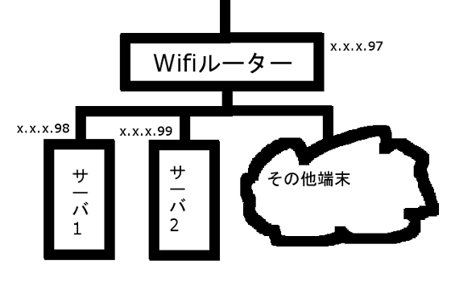

# アイドルと学ぶホームページの作り方(仮)

## 導入

律子「どうも最近、会社のサーバの調子がおかしいのよね…もしかして、亜利沙が悪さしてるのかしら」

亜利沙「さすがにしませんよ」

律子「そうね。そもそもこのサーバ、誰も管理のしかた知らないもの」

亜利沙「それ大丈夫なんですか？」

律子「今のところは問題ないのよ。更新は全部FTPでやってるから。なんだけど、さすがにこの調子だと3か月は持たないわね」

亜利沙「ってことは」

律子「当然、サーバは置き換え。必要なバックアップのとり方もわかってないから、それの対応も必要。さて、小鳥さんはこのサーバについて知ってるのかしら？」

小鳥「いえ。私がここに来たときにはすでにこのサーバは稼働してましたので」

社長「あー、このサーバは確か10年前に設置したはずだよ」

3人「10年前？」

社長「当時は765プロのアイドルは1人しかいなかったが、そのアイドルを大々的に告知するために、専任のエンジニアを雇って設置したんだよ。ま、その専任のエンジニアとそのアイドルは結婚していなくなってしまったがな」

律子「で、そのエンジニアは今どこにいるんです？」

社長「あー、もうすでにこの世にいないんだ。交通事故で結婚したアイドルに轢き殺されたんだ」

律子「引継ぎ書類は？」

社長「そんなものはない」

律子「いろいろダメみたいね。亜利沙、このサーバのアクセスが少ない時間見計らって管理可能なようにしておいて」

亜利沙「で、このサーバのOSは…、Linuxっぽいですね。細かいことは実際にサーバをシングルモードで起動しないとわからないので夜にでもやりましょうか」

そして夜になった。サーバを一時的に落としてシングルモードにしたうえで調べたところ、社長の言うことに間違いはなく、Ubuntu 8.04であることが判明した。

亜利沙「さすがに古すぎですね。CPUなんかもこれだけ古いとなると、今回パスワード再設定したにしてもOSのアップデートは無理そうです。そもそも64ビット非対応なので新しいOSは入らないです。とりあえず管理アカウントのパスワード設定して、再起動した後、そのアカウントのパスワードでログインしてsudoできるかとかサービスが立ち上がってるか確認して、と」

律子「今日は亜利沙は休みです。まあ夜通し作業してくれましたからね」

P「だよな…ただ、このサーバに関して全部情報残してくれたみたいだけど、さすがにこの10年もののマシンは置き換えたほうがいいんじゃないか？」

律子「そうね。まあ置き換えるにもバックアップとるための準備は必要ですからこの作業は必要でしたけどね」

P「で、置き換えるならいっそのこと765プロのページのリニューアルもしたらどうだ？」

律子「いいわね。で、誰がやるんです？プロデューサー殿は無理でしょう。私もさすがに無理ですよ。とりあえず、ここの機器全部置き換え前提で考えましょうか」

P「予算はどうするんだ？それと誰がその面倒な作業を…あ、亜利沙か」

律子「亜利沙へ、サーバの調整ありがとう。で、次の話だけど、サーバの置き換えと765プロのページのリニューアルをネットワーク関連機器ともどもやりたいから、そのあたりの構成と予算、それと実施内容を適宜書いて出しておいてね」

亜利沙「鬼ですか…。物理層からやれと」

## 物理層構築

亜利沙「確か志保ちゃんがWifiすらないこの部屋、どうにかならないんですかみたいなこと言ってましたね。ですけど、ここグローバルIPいくつ割り当てありましたっけ」

資料を調べたところ、この765プロには8IPアドレス(IPv4)が割り振られており、そのうちの1IPアドレスがこのサーバに、1IPアドレスがルーターに割り振られていた。ルーターが相当な骨董品なので、置き換えは前提ではあるが、それにしても設定の移行さえどうにかなればいけそうではある。

亜利沙「とりあえずこんな構成でいいですかね」



亜利沙「サーバマシンの構成はどうしましょうか。自分でマシンを組み立てるのもありですけど、それをするだけの意味はあまりないですね。出来合いのマシンを購入できるならしましょう」

前回の機種のスペックを見たところ、サーバ専用機ではなくパソコンを使っていたようだ。だから、今回もパソコンの性能で十分だろうとなった。とはいえ、ある程度さばくので、性能は少し高めに設定した。そのうえで見積もりを作成し、律子に提示すると、

律子「プロバイダは今のままだから料金に変化はなし。旧サーバは新サーバに置き換え。サーバは当座は2台でいい、と。これなら問題ないわね。じゃあ社長に決裁依頼するわよ」

社長は何もわかっておらず、値段を見て特に現状出せる費用であると判断するだけで、

社長「いいよ」

とあっさりOKを出した。というわけで、あとはこの予算通りに普通にマシンやルーターを調達した。

亜利沙「さて、いろいろきちんと設定しながらやっていきましょうか」

インターネットの配線やルーターの設定を調べながら、きちんとネットワーク構成をこの通りに設置しなおす必要があったが、旧マシンはそのまま配置した。新マシンはあとでリニューアル後のサイトができたら導入することにした。幸い10BASE-T対応のマシンだったので、1000BASE-Tネットワークにつないでも単に遅いだけで支障はないのであった。

## OSのインストールメディア作成

亜利沙「OSですが、Linux系で確定でいいでしょう。FreeBSDは癖が強すぎですし。あとは有償のもの(RHELなど)にするか、それとも無償のものにするかも先に決めないと…まあ無償のものでいいですね。もともとそうでしたし。あとはCentOSにするかUbuntuにするかですが、もともとUbuntu使ってましたから今回もUbuntuでいいですね。LTSじゃないと6か月ごとにOS入れ替えが発生するので、LTSにするのは決定だから…と。16.04か18.04になりますが、最新版の18.04でいいでしょう」

というわけでOSはUbuntu 18.04に決まった。

亜利沙「まずは https://www.ubuntu.com/download/server にアクセスして、と。そこからLTSダウンロードして、と。ディスクを焼くのは普通にやっていいですね。isoファイルはそんなに苦労せずに焼けるからいいです。ただ、サイズが大きいからDVDに焼きましょう」

## OSのインストール

亜利沙「まずは電源入れて、と。起動メディアが見つからないエラーが出たからまずはディスクを入れましょう。それが終わったら…」

基本的には、指示に従ってセットアップをしていけばよい。ただし、一部箇所は環境に依存して変更しなければならないので、少し面倒である。

## 必要なソフトウェアのインストール

亜利沙「まず、絶対に必要なのがApacheとPHPとMySQLですね。これがないと動かないので必須です。で、確かUbuntu 18.04だと…」

追加でインストールするソフトウェアは最低で以下の5個である。

- apache2
- php7.2
- libapache2-mod-php7.2
- mysql-client
- mysql-server

もろもろのソフトウェアのインストールについては各自参考サイトを読むことをお勧めする。

- ApacheとPHPのインストールは https://www.yokoweb.net/2018/05/12/ubuntu-18_04-apache2-php72/
- MySQLのインストールは https://www.yokoweb.net/2018/05/13/ubuntu-18_04-server-mysql/

## CMS検討

亜利沙「これまでCMSみたいのが何もなかったですけど、これだと毎回記事更新するたびにHTMLを作らないといけないですし、何より毎回見た目が変わって非常に面倒くさいです。やっぱりCMSは必須ですね」

律子「CMS導入するのはいいけど、どんなCMS導入するの？」

亜利沙「ざっと思い浮かぶ限りではフリーのものだけでWordPress、Drupal、Joomla!、concrete5の4種類があります。商用のものまで含めるともっと増えます」

律子「で、どれがおすすめなの？」

亜利沙「WordPressですね。特に複雑な権限管理が必要なくて、シンプルなサイト構築を目指すなら、これ以外の選択肢はないです」

律子「じゃあ、とりあえず構築してみて」

基本的に、ページを作成する人が管理をしやすくするためのツールがCMSである。多くのところでCMSを用いており、そのCMSを使うと、見た目の統一などが非常にやりやすい。今回の構築でもそれを用いることにしたのである。

## WordPress導入

亜利沙「まずはダウンロードしましょうか。日本語版をインストールするから、 https://ja.wordpress.org/download/ から最新版をダウンロードして、解凍して、中身を/var/www/htmlに入れましょう。あとは忘れずにApacheのconfigを書き換えてAllowOverride allをサーバのディレクトリに設定して再起動しないと。/var/www/htmlのパーミッションとオーナーの設定も忘れずにやって、と。ここまでやったらブラウザを開いて設定を始めましょうか」

ページを開くと、以下のような画面が出てくるはずである。


亜利沙「さあ、始めましょう！ボタンをクリックして、と。次はDBの設定ですね」


## セクション

本文本文本文本文本文本文本文本文本文本文本文本文本文本文本文本文本文本文本文

## セクション2

本文本文本文本文本文本文本文本文本文本文本文本文本文本文本文本文本文本文本文


|hoge|huga|
|:-:|:-:|
|テスト|test|
|犬|猫|


```
$ npm install
```

今日は，`インラインコード`な気分です．

実は，*イタリック*な気分です．

そう思わせて，**強調**な気分です．

- 箇条書き
- 箇条書き
- 箇条書き

1. 数字付き箇条書き
2. 数字付き箇条書き
3. 数字付き箇条書き

本文本文本文本文本文本文本文本文本文本文本文本文本文本文本文本文本文本文本文

## セクション3

本文本文本文本文本文本文本文本文本文本文本文本文本文本文本文本文本文本文本文