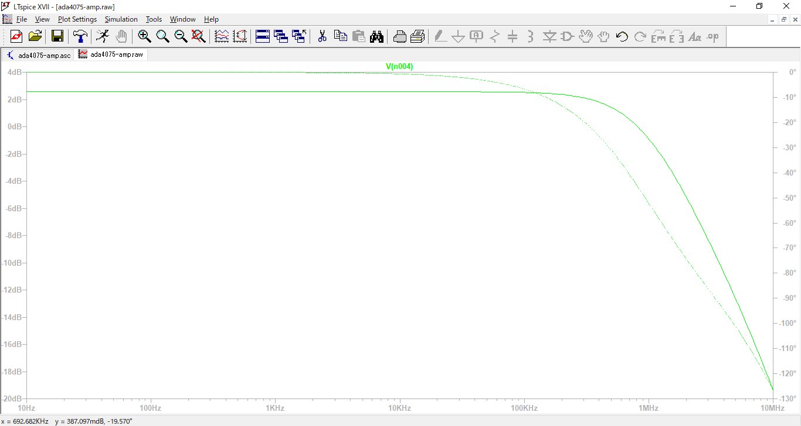
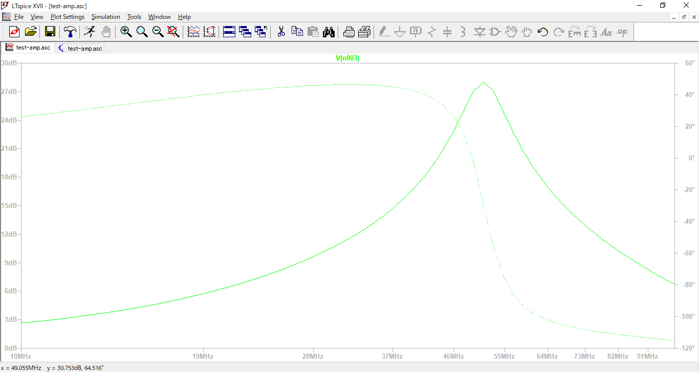

# 李衣菜チャンの<br>ヘッドホンアンプをつくるにゃ！

## この本を読んでいただく前に
この本を読んでいただく前に、知ってほしいことやお伝えしたいことを記しておきます。

### 最初にお伝えしたいこと
李衣菜チャンのためにみくにゃんが奮闘する電子工作の本です。
- とりあえずヘッドホンアンプをつくりたい
- 回路を組んだけど、実際動くか不安
- ブレッドボードやユニバーサル基板は飽きた

といった方には、有意義に読んでいただけると思います。

### この本でできること
この本では以下のことをすることができます。
- 回路設計の基本
- 回路シミュレーション入門
- EAGLEを使って回路を組んで、基板をつくる。

この本は、電子工作実践編となっています。あなたのお力になれれば幸いです。

### 必要な知識
 - オームの法則
 - 2D CADの知識（画像編集ソフトでも可）

## 回路設計の基本
この章ではヘッドホンアンプをつくるにあたって構想を練ります。
以下の流れで設計を行います。
1. アンプを決める
2. 電源を決める
3. 回路図を書く

### １．アンプを決める
アンプといっても様々な種類があります。今回はオーディオ増幅のため低周波アンプ回路となります。アンプ回路の中心となる素子にはおおよそ以下の種類があります。
- 真空管
- トランジスタ
- オペアンプ

どれも、良し悪しがあり一概には言えませんが、簡単に実用性のあるものとなるとオペアンプに軍配が上がります。今回は、オペアンプを用いたアンプ回路とします。（本当は、トランジスタと組み合わせると尚良いです。）

回路はこちら、オペアンプの教科書によくある非反転増幅回路にいくつか周辺部品を追加したものです。巷ではCMoy式と呼ばれるものです。まず抵抗R1とR2で増幅度を決めます。
<center>

</center>
上記式より、約5.5倍となります。R3は入力抵抗と呼ばれオペアンプのバイアス電流を流します。R3の値はそのまま回路の入力インピーダンスとなります。R4は出力抵抗と呼ばれ出力インピーダンスを設定し、また回路の安定化を図る役割を持ちます。

これをベースに作りこんでいきます。

### ２．電源を決める
回路を動かすには電源が必要です。オペアンプは両電源が必要なため、一工夫必要となります。李衣菜チャンのヘッドホンアンプは持ち運びしたいので、モバイルバッテリーとか使えるUSB電源にします。USBは単電源のためそのままでは回路に供給できません。そこでDC-DCコンバーターを用いて単電源5Vから両電源12Vに昇圧します。

### ３．回路図を書く
手書きでも、ペイントでも、GIMPでもなんでも書けますが、シミュレーションをするためLTspiceで書きます。これについては、次章で詳しく解説します。

## 回路シミュレーション入門
回路シミュレーションでは、PC上で回路を組んで特性を見る事ができます。難しそうとか、値段が高いイメージがあると思いますが、LTspiceという便利なシミュレーションソフトがあります。ベンダーから出ているしっかりしたもので、無料で利用できます。入手先`Analog Devices`　www.analog.com
1. モデルを取り込む
2. 回路を書く（実践編）
3. シミュレーションしてみる

### １．モデルを取り込む
回路をシミュレーションするためには、モデルが必要です。SPICEモデルと呼ばれるものです。中身はテキストファイルなので覗いてみてください。色々と書いてありますが、要するにパーツの特性を表しています。

これは、オペアンプ「ada4075.cir」の例です。
```
* ADA4075-2 SPICE DMod model Typical values
* Description: Amplifier
* Generic Desc: 9/30V, BIP, OP, Low Noise, Low THD, 2X
* Copyright 2008, 2012 by Analog Devices

.SUBCKT ADA4075 3 2 7 4 6

* Input Impedances
I1 0 3 -2.700E-008
I2 0 2 -2.700E-008
G3 3 2 3 2 2.041E-005
R1 3 0 6.200E+008
R2 2 0 6.200E+008
C1 3 0 2.500E-012
C2 2 0 2.500E-012
C3 3 2 2.400E-012
```
デバイスが変わってもこの記法は変わりません。共通の言語となっています。

LTspiceで「File」ー「Open」で先ほどのcirファイルを開きます。コードが表示されるので、その中.SUBCKT ADA4075行を選択し、右クリックで「Create Symbol」でモデルを取り込む事ができます。この読み込んだモデルはシンボルファイルとして、「AutoGenerated」内に作成されますので覚えておいてください。

### ２．回路を書く（実践編）
ヘッドホンアンプの中心部、オペアンプを選定します。今回はAnalogDevices ADA4075-2としました。特に深い意味はありません、音質等気にされる方は別なオペアンプを選定してください。ただし、高速オペアンプは取り扱いが難しいです。これを何とかするために回路のシミュレーションを行ないます。

LTspice上で「New Sechematic」を選び新規回路図を作成します。そして１．章で作成したシンボルファイルを読み込みます。

それ以外の部品はツールバーに表示されているので、まずは回路図の通りに部品を配置していってください。お絵描き感覚でできるので、結構楽しいと思います。部品間をつなぐには「Wire」を使用してつなぎます。これで完成です。意外と簡単だと思います。

### ３．シミュレーションしてみる
では、実際にシミュレーションをしてみましょう。今回のヘッドホンアンプで重要となるのは過渡特性です。高速オペアンプを使用した際に高い周波数で発振してしまわないかを確認します。ツールバーの「Simulate」ー「Edit Simulation command」を選びます。設定画面が現れるので以下のように設定します。

ツールバーの「Simulate」ー「Run」を選びます。するとシミュレーションが開始されます。最初は何も表示されませんが、マウスで出力ポイントをクリックすると、以下のように表示されます。

このようになだらかなカーブを描いていれば安定して動作します。高い周波数領域で波打っていたりすると動作不安定の可能性があります。

悪い条件の場合も載せますので参考にしてみてください。オペアンプは広帯域のLM7171（ビデオアンプ等に使われるもの）



好きなオペアンプを選んで、色々な条件でシミュレーションしてみてください。実際に回路を組んでから問題があると大変なので、前もってわかるという事はとても有意義なことです。

## EAGLEで基板をつくる
せっかくなので、作った回路を実際のものにしてみましょう！AutoCADを手掛けるメーカーのEAGLEという電気CADを使います。基板サイズ等に一部制限がありますが、十分な機能を兼ね備えています。
1. 部品ライブラリの作成
2. 回路図を書く
3. 基板を書く
4. 注文してみる

### １．部品ライブラリの作成
電気CADでは独特の作法があります。その一つが部品ライブラリです。部品ライブラリには実際に使う部品の寸法などが登録されます。抵抗一つ取っても、いくつもの種類があります。これを組み合わせて回路を書きます。EAGLEにはあらかじめ部品ライブラリが用意されているので合う部品があればそれを使います。

### ２．回路図を書く
今回、設計した回路はこちら。非反転増幅回路をベースに各種定数を決めました。部品は2018年9月現在、秋月電子で容易に入手できるものとしました。

|＜主な仕様＞|
|:-:|:-:|:-:|
|ライン入力は3.5mmジャック|
|ヘッドホン出力は6.3mmジャック|
|スイッチ付きボリューム|
|インジケータLED付き|


### ３．基板を書く
基板を書く作業をアートワークと言います、これが終わると以下のようになります。今回の基板は両面基板のため、スルーホールと呼ばれる接続箇所を用いて表裏を接続します。李衣菜チャンのサインはトレースして表面パターンで書いてみました。蘭らんのサインは超難しそう。


### ４．注文してみる
ひと昔前ならいざ知らず、今では数万円もあれば個人で基板製造をお願いする事ができます。
- P板.com
- ユニクラフト

この辺の業者さんは安くて実績もありますので、利用してみてはいかがでしょうか。今回私はユニクラフトさんの無料キャンペンーンで一枚サービスしてもらいました。

必要なデータ
- ガーバーデータ
- ドリルデータ

これらのデータは基板製造に必ず必要となるものです。今回使用したEAGLEにも標準でデータ作成機能があります。

## おわりに
李衣菜チャンがいつも身に着けているヘッドホンがGRADOのモデルをモチーフにしていたのでそのクラスのヘッドホンを鳴らしきるアンプを目標に作ってみました。フラグシップモデルGS2000eのスペックは

周波数特性 4～51,000Hz <br>
インピーダンス 32Ω

という特性でしたので、広帯域で安定して鳴らせるようにしました。ただし、昇圧型DC-DCを使っているのでノイズ対策を施してあります。また、カップリングコンデンサが無いのでDC成分が含まれる入力ソースではヘッドホンにダメージを与える可能性がありますので注意してください。

皆様のヘッドホンライフが良いものとなることを願っております。

＠ヘヴろく

