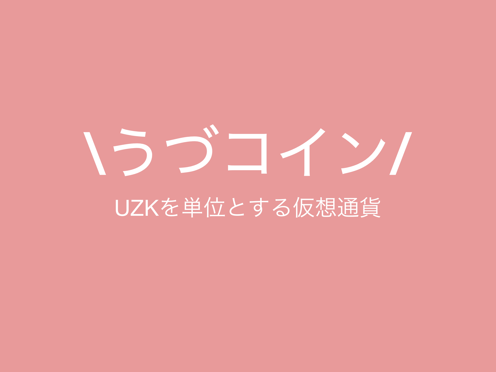
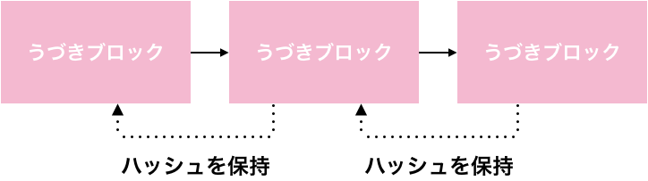
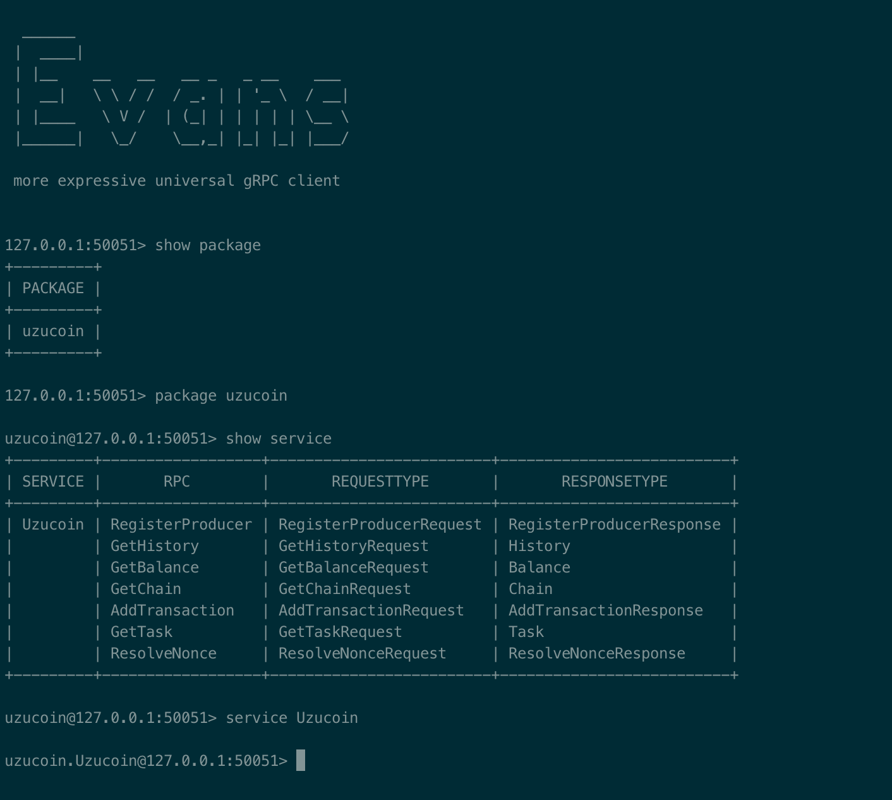

# うづコインを支える技術
<p class="right">著:kagemiku</p>

## はじめに
プロデューサーの皆さん、担当アイドルのこと、ちゃんとすこですか？僕はすこです。あ〜すこ。すこの形はいろいろあると思います。グッズを買うというすこ。楽曲をひたすら聴くというすこ。 神棚でフィギュアを祀るというすこ。みんな違って、みんなすこい。中でも、副業でエンジニアをされているプロデューサーの方々は、ちょっとしたプロダクトやサービスを開発する、という形ですこを表現している方も多いと思います。
例を挙げると、**im@sparql**(\*1)などがそうです。これは特定のアイドルに対するすこというより、「アイドルマスター」という文化そのものに対するすこという、より上位次元のすこを表現していると思われます。本章で解説する「うづコイン」も、そういったすこすこプロダクトの中の一つです。

<footer>\*1 https://sparql.crssnky.xyz/imas/</footer>

## うづコインとは？
あ〜卯月すこ！すこだな〜〜という思いから生まれた、推し仮想通貨です。アイマスハッカソン2017(\*2)で爆誕しました。



酔っ払って作ったものなのでよく覚えていませんが、これは当時の発表スライド(\*3)です。**UZK**を単位とする、推し仮想通貨です。


<footer>\*2 https://imas.connpass.com/event/70592/</footer>
<footer>\*3 https://speakerdeck.com/kagemiku/udukoin</footer>


### うづきチェーン
うづコインの取引記録は、「うづきブロック」と呼ばれるブロックに保存されており、このブロック同士を単方向リストとしてつなげたものを「うづきチェーン」と呼びます。本当です。各うづきブロックは、一つ前のうづきブロックのSHA256ハッシュ値(へご値とも呼ばれている)を保持しています。



各うづきブロックは次の情報を保持しています。

* transaction : 取引記録
* nonce : ノンス(後述)
* prevHash : 直前のうづきブロックのハッシュ値(へご値とも呼ばれている)
* resolverUID : ノンスを提供したプロデューサーのID(後述)

また、`transaction`には次の情報が含まれています。

* fromUID : 送金元のプロデューサーID
* toUID : 送金先のプロデューサーID
* amount : 送金額[uzk]
* timestamp : 送金要求を行った時刻のタイムスタンプ

### S(min)ING!
うづきチェーンに新しくうづきブロックを追加する際には、追加しようとしているうづきブロックが、「いい感じ」のハッシュ値を持つように調整しなければなりません。この調整を行うための値が「ノンス」となります。この「ハッシュ値がいい感じ」になるようなノンスを見つける作業は簡単なものではなく、それ故に、ノンスを見つけたプロデューサーに対しては一定の報酬(うづコイン)が支払われるようになっています。ノンスを見つけだし報酬を得ることは、他のプロデューサーからの送金以外で、プロデューサーが新たなうづコインを受け取る唯一の方法となっています。

 「いい感じ」の定義は、うづきブロックのSHA256ハッシュ値(へご値とも呼ばれている)内に、次の文字列のASCII列が含まれていることです。

<br/>
<br/>
<br/>

| 文字列 | 報酬 |
|:------:|:----:|
| uzuki  | 24.0 |
| uzu    | 4.0  |
| zuki   | 4.0  |
| u      | 1.0  |
| zu     | 1.0  |
| ki     | 1.0  |

表内のASCII列が含まれているハッシュ値になるノンスを提供したプロデューサーには、それぞれ対応する報酬(うづコイン)がもらえます。ちなみに島村卯月の誕生日は4/24です。偶然ですね。ちなみに、この「ノンスを見つけ出す作業」は、一般に**S(min)ING!**と呼ばれています。偶然ですね。


## サーバ実装
うづコインのサーバはGoで実装されており、クライアントに対してはgRPC(\*4)を用いてAPIを提供しています。~~2019/02/16現在、コードの公開はしておりませんが、整備が完了し次第publicにする予定です。本当です。多分。~~ **grpc/grpc-go**(\*5)をベースに用いており、サーバサイド向けに解釈したClean Architectureをアーキテクチャとして採用しています。


執筆中に気が変わったので公開しました。(\*6)

* [kagemiku/uzucoin](https://github.com/kagemiku/uzucoin)

<footer>\*4 https://grpc.io/</footer>
<footer>\*5 https://github.com/grpc/grpc-go</footer>
<footer>\*6 https://github.com/kagemiku/uzucoin</footer>
<footer>\*7 https://developers.google.com/protocol-buffers/</footer>


### 通信について
通信は前述の通り、gRPCを用いて行います。データ構造およびAPIの定義は**Protocol Buffers**(\*7)を用いています。うづコインでも用いているProtocol Buffersファイルの一部を次に示します。

```
service Uzucoin {
    rpc RegisterProducer(RegisterProducerRequest) returns (RegisterProducerResponse);
    rpc GetHistory(GetHistoryRequest) returns (History);
    rpc GetBalance(GetBalanceRequest) returns (Balance);
    rpc GetChain(GetChainRequest) returns (Chain);
    rpc AddTransaction(AddTransactionRequest) returns (AddTransactionResponse);
    rpc GetTask(GetTaskRequest) returns (Task);
    rpc ResolveNonce(ResolveNonceRequest) returns (ResolveNonceResponse);
}
```


## Let’s S(min)ING!
それでは、みんな大好きな**S(min)ING!**をしてみましょう。ここから先はちょっとややこしいです。macOSにおける説明のみ行います。また、goの環境などはすでに構築されている前提で行います。すまん。がんばります。

まずは環境構築から。雑にREADMEの内容をペッと貼ります。

```
$ # install protobuf
$ brew install protobuf
$
$ # install protobuf plugin for go
$ go get -u github.com/golang/protobuf/protoc-gen-go
```

次に、**kagemiku/uzucoin**をcloneし、`make`を走らせます。

```
$ git clone git@github.com:kagemiku/uzucoin.git \
> $GOPATH/src/github.com/kagemiku/uzucoin
$ cd $GOPATH/src/github.com/kagemiku/uzucoin
$ make dep && make
```

これでうづコインサーバが起動しました。次はクライアントの起動です。現状、S(min)ING!できるまともなClient実装がないため、コマンドラインから直接APIを叩きます。**evans**(\*8)という、いい感じなCLIのgRPCクライアントがあるので、それを使用します。


<footer>\*8 https://github.com/ktr0731/evans</footer>

```
$ brew tap ktr0731/evans
$ brew install evans
$ evans protobuf/uzucoin.proto
```

evans起動後は、packageおよびserviceの選択を行います。

```
127.0.0.1:50051> package uzucoin
uzucoin@127.0.0.1:50051> service Uzucoin
```

ここまで終わると、次のような画面になっているはずです。多分。


<br/>
<br/>



<br/>
<br/>
<br/>
<br/>
<br/>
<br/>
<br/>

ここからが本番です。気合をいれましょう。まずはプロデューサーの登録をします。うづコインを送る相手としてuzukiという方もプロデューサー登録をしておきます。

```
uzucoin.Uzucoin@127.0.0.1:50051> call RegisterProducer
uid (TYPE_STRING) => kagemiku
name (TYPE_STRING) => kagemiku
{
  "succeeded": true
}

uzucoin.Uzucoin@127.0.0.1:50051> call RegisterProducer
uid (TYPE_STRING) => uzuki
name (TYPE_STRING) => uzuki
{
  "succeeded": true
}
```

次に、uzukiという方へ424うづコイン送ります。プロデューサー登録すると初めに424うづコインもらえます。余談ですが島村卯月の誕生日は4月24日です。

```
uzucoin.Uzucoin@127.0.0.1:50051> call AddTransaction
fromUID (TYPE_STRING) => kagemiku
toUID (TYPE_STRING) => uzuki
amount (TYPE_DOUBLE) => 424
{
  "timestamp": "2019-02-19 23:21:00.251881 +0900 JST m=+36.991302071"
}
```

この時点ではまだ送金は完了していません。ノンスを見つけてあげて、うづきチェーンにうづきブロックとして取引記録を追加してあげる必要があります。まずは現在のタスクを確認しましょう。

```
uzucoin.Uzucoin@127.0.0.1:50051> call GetTask
{
  "exists": true,
  "transaction": {
    "fromUID": "kagemiku",
    "toUID": "uzuki",
    "amount": 424,
    "timestamp": "2019-02-19 23:21:00.251881 +0900 JST m=+36.991302071"
  },
  "prevHash": "d9578cfdea09b7af6b72ae7a35f35e2cfccc83486d8e7b716f2f32e3701f9ce6"
}
```

Let's S(min)ING! いい感じのノンスを見つけてあげましょう。`prevHash`には直近のうづきブロックのハッシュ値を、`nonce`にはノンスを、そして`resolverUID`には先程登録した自分のプロデューサーIDを入力します。

```
uzucoin.Uzucoin@127.0.0.1:50051> call ResolveNonce
prevHash (TYPE_STRING) => d9578cfdea09b7af6b72ae7a35f....長いので省略
nonce (TYPE_STRING) => shimamura
resolverUID (TYPE_STRING) => kagemiku
{
  "succeeded": true,
  "reward": 1
}
```

今回は紙面の都合上、一発でS(min)ING!に成功したようになっていますが、実際は泥臭い作業をやってます。

本当にuzukiという方に送金ができたか、確認してみましょう。

```
uzucoin.Uzucoin@127.0.0.1:50051> call GetHistory
uid (TYPE_STRING) => kagemiku
{
  "transactions": [
    {
      "fromUID": "kagemiku",
      "toUID": "uzuki",
      "amount": 424,
      "timestamp": "2019-02-19 23:21:00.251881 +0900 JST m=+36.991302071"
    }
  ]
}
```

あ〜すこ。


## おわりに
2019年中にもっと整備して、ゆくゆくはWebクライアントなども公開していきたいです。がんばります。えへ。
