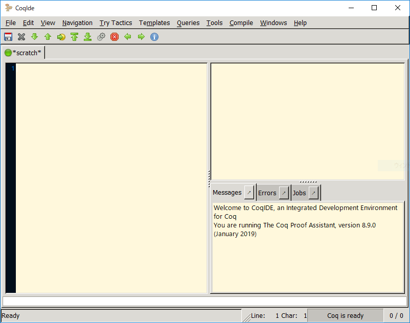

# アイマスを「証明」してみる話
<p class="right">著:きりだるま</p>

## アイマスを「照明」する

「アイマス最高！」と事あるごとに言い続けている我々プロデューサーですが、本当にアイマスは最高なんでしょうか？
疑問に感じたので、Coq(8.9.0)を使って証明しようと思います。

## お断り

理論や実際に役に立つことは書きません(書けません)

- Coqっていうのがあるんだ
- Coqってこんなことができるんだ
- アイマスを証明する！

という雰囲気ですので、面白半分です。

## セットアップ

### インストール

難しくないです。
Linuxであれば、ディストリビューションのパッケージ管理マネージャに用意されていると思います。
また、MacであればMarPortsやhomebrewに入っているようです。
Windowsユーザか、お使いのLinuxディストリビューションのパッケージが見つからない方は、
GitHubのreleaseページからインストーラを引っ張ってきて実行すればいろいろ入ります。

https://github.com/coq/coq/releases

基本的にCoqIDEというのを使うのが普通のようです。
今回もそれに倣い、CoqIDE上で進めていきます。

### Coqの使い方(CoqIDEの使い方)

CoqIDEを開くと、次のようなウィンドウが表示されると思います。



左側の大きなスペースがスクリプトを記述していく箇所です。
右上は証明モードで使用します。
また、右下はエラーやCoqからのレスポンスやエラー等のメッセージが表示されるスペースです。

基本的に、左側のスペースにスクリプトを記述していき、
ウィンドウの上部にある緑の矢印をポチポチして、1行ずつスクリプトを読み込み/巻き戻しして試行錯誤しながら、プログラミングや証明を行っていきます。

### Coqの学び方

知りません。
多分、本や各種ネット上の記事等を見ると良いと思います。

筆者はCoqに全く詳しくないです。
論理学も全くの専門外です。
自分は単にアイマスを「証明」したいというモチベーションでやっています。

## 証明してみる

### 論理の"Hello, World"、三段論法

プログラムであれば最初は"Hello, World"だと思うんですが、Coqで"Hello, World"をするのは難しいようです。
なので、ここは論理の"Hello, World"ともいえる**三段論法**を証明したいと思います。
「ソクラテスは人間、人間はいつか死ぬ、なのでソクラテスはいつか死ぬ」というやつですね。

まず、証明の全体像を載せておきます。

```coq
Theorem hibiki_is_cute: forall (Hibiki Idol Cute : Prop),
(Hibiki -> Idol) -> (Idol -> Cute) -> (Hibiki -> Cute).
intros.
apply H0.
apply H.
apply H1.
Qed.
```

さて、少し解説していきます。
Theoremというのは定理という意味で、これはCoqを証明モードにするワードです。
また、hibiki_is_cuteは今から証明しようとしている定理の名前です。
Coqでは、証明した定理に名前を付けて後から使用したりもできます。

その次のforallから最後のピリオドが証明したい式です。
順に見ていきましょう。

forallは「任意の」にあたるワードです。
数学でいうところの`∀`ですね。
forallはその次の括弧にかかっています。
`Hibiki Idol Cute : Prop`となっていますが、これは`Hibiki、Idol、Cuteという命題を宣言する`という感じの意味です。
つまり、ここは「任意の我那覇響、アイドル、可愛いという命題について...」という証明したい定理の条件を表しています。

その次にあるものが証明したい式の実体です。
`(Hibiki -> Idol) -> (Idol -> Cute) -> (Hibiki -> Cute)`となっています。
`->`はその前後の命題について「〇〇ならば××」という意味です。
つまり、この部分は「(我那覇響ならばアイドル)、(アイドルならば可愛い)、ならば(我那覇響ならば可愛い)」という意味になります。

Coqでは、証明したい式が真(正しい)ということを証明していきます。
なので、最初の部分をざっくりと日本語化すると

```
定理、響は可愛い(
    任意の我那覇響、アイドル、可愛いについて、
    我那覇響はアイドル、アイドルは可愛い、ならば、我那覇響は可愛い
)は真である。
```

みたいな感じになります。
これを読んでいるプロデューサーなら分かる通り、これは自明ですね。
ですが、最初なのでチュートリアルもかねて順に見ていきましょう。

ツールバーにある緑の下向きの矢印を一度押すと、一行読み込めます。
一度押すと、`Theorem...`の行が読み込まれて、CoqIDEが証明モードに移ります。

```
1 subgoal
______________________________________(1/1)
forall Hibiki Idol Cute : Prop,
(Hibiki -> Idol) -> (Idol -> Cute) -> Hibiki -> Cute
```

おそらく、上の例のように表示されていると思います。
真ん中の傍線で仕切られた上の部分は今は空ですが、証明を進めていくうちに、証明するのに使用できる仮定や命題のリストが表示されます。
傍線で仕切られた下の部分は、現時点での証明対象の式が表示されます。
基本的に証明モードでは、証明対象の式を簡約化しつつ使用出来る仮定や定理を増やしていき、それらを使って証明を進めていきます。

それでは早速証明を行っていきます。
もう一度緑の下矢印のボタンを押すと、次のように出力が変わると思います。

```
1 subgoal
Hibiki, Idol, Cute : Prop
H : Hibiki -> Idol
H0 : Idol -> Cute
H1 : Hibiki
______________________________________(1/1)
Cute
```

使用出来る命題が増えて、証明対象の式が一気に簡約化されました。
証明モードでは**tactic(タクティック)**と呼ばれる操作を行って証明を進めていきます。
3行目の`intros`は、証明対象の式中の`forall...`や`A -> B`の形の部分を全てばらしてくれるタクティックです。

さて、証明対象の式がばらされた結果、証明に使用出来る「武器」がたくさん手に入りました。
ザッと手持ちの武器を見た感じ、このまま一気に証明できそうなのでやっていきましょう。
緑の下矢印のボタンをもう一度押すと、下のように変化すると思います。

```
1 subgoal
Hibiki, Idol, Cute : Prop
H : Hibiki -> Idol
H0 : Idol -> Cute
H1 : Hibiki
______________________________________(1/1)
Idol
```

4行目の`apply 〇〇`は、「命題〇〇を証明対象の式に適用する」というタクティックです。
ここでは、`H0 : Idol -> Cute.`という命題を適用しています。
この`H0`という命題は、3行目の`intros`タクティックによって自動的に生成された命題です。

さて、これにより、証明対象の式が`Cute`から`Idol`に変化しました。
どんどんやっていきましょう、緑の下矢印のボタンをもう一度押すと、先ほどと同じく下のように証明対象の式が変化すると思います。

```
1 subgoal
Hibiki, Idol, Cute : Prop
H : Hibiki -> Idol
H0 : Idol -> Cute
H1 : Hibiki
______________________________________(1/1)
Hibiki
```

次は`H : Hibiki -> Idol`という命題を適用しました。
もう一息です。
もういちど緑の下矢印のボタンをもう一度押すと、下のようになると思います。

```
No more subgoals.
```

「これ以上、証明対象の式はありません」
つまり、これで「我那覇響は可愛い」という定理を証明したことになります。
最後にもう一度緑の下矢印のボタンを押して、高らかにQedを宣言しましょう。
`Qed.`と打ち込むことによって、証明モードが終了します。

### 関数と型の定義

さて、先ほどは我那覇響は可愛いという(自明な)定理を証明しました。
Coqは証明支援プラットフォームですが、同時に関数指向プログラミング言語でもあります。
OCamlといったML系の言語やHaskellに近い構文と機能を持った言語です。

Coqで関数は下のように定義できます。

```
Definition add_one x := x + 1.
```

上の例は`add_one`という引数を一つ取って、それに1を足して返す関数です。
このように、

```
Definition <関数名> [<引数>...] := <処理>.
```

という風に関数を定義します。

また、Coqは関数指向プログラミング言語であると同時に、強い静的型付け言語でもあります。
型の定義は下の例ように定義します。

```
Inductive Asterisk : Set :=
  | riina : Asterisk
  | miku : Asterisk
.
```

これで、型`Asterisk`が定義できました。
2行目と3行目の箇所は、Haskellでいう値コンストラクタを定義している箇所です。
値コンストラクタとカッコいい名前がついてますが、
要は「その型の値を返す関数」なので、ただの関数です。
＊(Asterisk)のメンバーは多田李衣菜と前川みくの二人なので、当然Asteriskを構成する値は`riina`と`miku`です。

型定義の書き方を一般的に書くと、

```
Inductive <型名> [(<型引数>) ...] : Set :=
  [| <値コンストラクタ名> [<引数>] : <値コンストラクタの型定義>]
  ...
```

というような感じになります。
今回はありませんが、多相な型(テンプレート/ジェネリクス)も定義できます。

### Asteriskの交換法則を証明する

さて、先の例で型`Asterisk`を定義しましたが、面白そうなのでAsteriskに関する処理をちょっと書いてみましょう。

```
Inductive Asterisk : Set :=
  | riina : Asterisk
  | miku : Asterisk
.

Inductive State : Set :=
  | formed : State
  | dissolution : State
.

Definition makeUnit (x y : Asterisk) : State :=
  match x, y with
    | riina, riina => dissolution
    | miku, miku => dissolution
    | _, _ => formed
end.

Notation "x ＊ y" := (makeUnit x y) (right associativity, at level 60).
```

順に見ていきましょう。
まず、型`Asterisk`と`State`が定義されています。
`Asterisk`はユニットである＊(Asterisk)を、`State`は現在の解散芸の状態を表しています。
よく「解散(だ！)(にゃ！)」と痴話喧嘩をやっている二人ですが、その状態を表しています。

その次は、関数`makeUnit`が定義されています。
何やらmatchというワードがありますが、これはいわゆるパターンマッチです。
二つ引数を、二つとも`riina`か`miku`の場合は`dissolution`で解散状態、
引数の二つの値が互いに違う場合は`formed`でちゃんとユニットが組まれたままという3つに場合分けを行っています。
`dissolution`の場合は、おそらく喧嘩をして互いに別々の場所にいる状態と思われます。
`formed`の場合は何とか仲良くやっているようです。

最後の行のNotationから始まる行ですが、これは関数`makeUnit`を中置演算子`＊`として定義しています。
あってもなくても処理自体は変わらないんですが、中置演算子を定義しておくと書くのが楽なので一応定義しています。

では、これらの型と関数を定義したうえで、Asteriskの~~カップリング~~演算は交換法則が成り立つことを証明しましょう。
交換法則と言えば、`x + y = y + x`のような処理のことですね。
普通の数に対しては足し算/掛け算ともに成り立ちますが、行列の掛け算はこれが成り立たないことは有名ですね。

＊(Asterisk)の二人に交換法則が成り立つ。
これはつまり、どちらが上だとか関係なく互いに同等であり、
掛ける方/掛けられる方関係なく互いに影響を与え合っている...。
と言えるのではないでしょうか。

では、さっそく交換法則を証明してみます。

```
Theorem asterisk_commutative_law: forall (x y : Asterisk), x ＊ y = y ＊ x.
intros.
destruct x.
destruct y.
simpl.
reflexivity.
simpl.
reflexivity.
destruct y.
simpl.
reflexivity.
simpl.
reflexivity.
Qed.
```

さて、先ほどの三段論法の証明と比べて少し長いですが、やっていることはワンパターンなので簡単です。
順に見ていきましょう。

まず、`intros`でforallを外します。
ここは先ほどの三段論法と一緒ですね。

次に、`destruct`タクティックを使用します。
すると、次のように証明対象の式が変化すると思います。

```
2 subgoals
y : Asterisk
______________________________________(1/2)
riina ＊ y = y ＊ riina
______________________________________(2/2)
miku ＊ y = y ＊ miku
```

2 subgols...となって、証明対象の式が二つに分裂しました。
これは、場合分けを行うタクティックで、
その型の値すべて1つ1つのケースに注目して順に証明を行って、すべて証明出来たらそれは正しいというアプローチです。
今回の証明対象である型`Asterisk`は、二つの値が存在するので、2つに証明対象の式がわかれました。
値xについて場合分けを行ったので、xが`riina`と`miku`に変化しています。
数は増えましたが、やることは同じです。
順に一つづつ証明していきましょう。

もういちど、今度はyについて場合分けを行います。
すると、下のように証明対象の式が変化します。

```
3 subgoals
______________________________________(1/3)
riina ＊ riina = riina ＊ riina
______________________________________(2/3)
riina ＊ miku = miku ＊ riina
______________________________________(3/3)
miku ＊ y = y ＊ miku
```

さて、さらに証明対象の式が増えました。
が、ここまで来ると、＊演算子(関数`makeUnit`)の定義より分かる通り、もはや自明ですね。
こういう時は、`simpl`タクティックが有効です。
`simpl`は、その名の通り計算できる箇所を計算して、簡約化できる箇所を簡約化してくれるタクティックです。
緑の下矢印のボタンを押して`simpl`タクティックを適用すると、次のように変化します。

```
3 subgoals
______________________________________(1/3)
dissolution = dissolution
______________________________________(2/3)
riina ＊ miku = miku ＊ riina
______________________________________(3/3)
miku ＊ y = y ＊ miku
```

はい、ここまでくると確信をもって「等しい」と言えますね。
証明対象の式が正しいことがここまで明確になると、`reflexivity`タクティックが使えます。
`reflexivity`は、等式を処理して証明対象の式の証明を完了させます。

```
2 subgoals
______________________________________(1/2)
riina ＊ miku = miku ＊ riina
______________________________________(2/2)
miku ＊ y = y ＊ miku
```

はい、証明対象の式が一つ消えました。
ここまでくると、後はパターンです。
場合分けを行って(`destruct`)、計算できる箇所を計算して(`simpl`)、等式を処理(`reflexivity`)の流れ作業となります。
どんどん緑の下矢印のボタンを押して、＊(Asterisk)の二人の関係を証明しましょう。

## まとめ

さて、今回はCoqを使って証明で遊ぶ方法の紹介ということで簡単な物を取り上げましたが、より難しくて複雑な命題を考えて、それを証明するのも面白いです。
証明に用いるタクティックはネットで検索したりすると色々出てきます。
数学的な知識が必要になる面も多いですが、遊ぶだけなら適宜勉強しつつでも楽しめます。

「証明って難しそうに感じたけど、これだとユニットテストとそんなに変わらないかも」と思われた方もいると思います。
自分も実際その通りだと思っていて、ただしCoqは言語仕様レベルからそのことが考えられているので、
より抽象的かつ網羅的に「正しさ」を担保できるところが強いと考えています。
これを機に、あなたも色々証明してみましょう！

数学は数や構造、空間といった事象を厳密かつ抽象的に解き明かしていく学問です。
その厳密性と抽象性の土台の上で「正しい」と証明されたことは絶対に正しいと言えます。
自分がCoqを使っていろいろと証明をして遊んでいるのは、
その「絶対に正しいと言い切れる」というのが一つのモチベーションになっています。

つまり、今回証明した

- 我那覇響は可愛い
- ＊(Asterisk)の交換法則

この二つは、前提として置いた条件の範囲内ではありますが、絶対に正しいと言い切れます。
つまりこれは、**普段フィーリングで言っている持論が正しいと言える**かもしれないわけです。

同僚の皆さん、担当アイドルを証明してみませんか？
