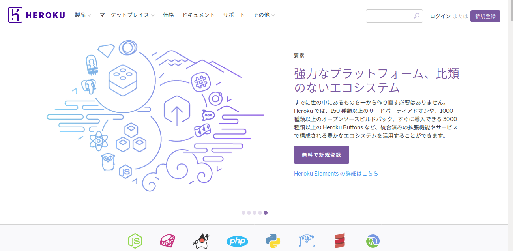
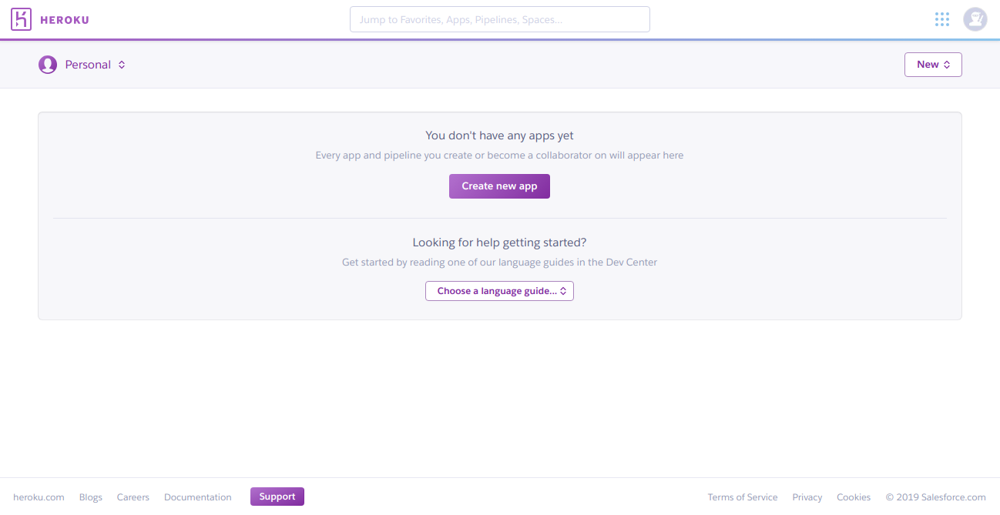
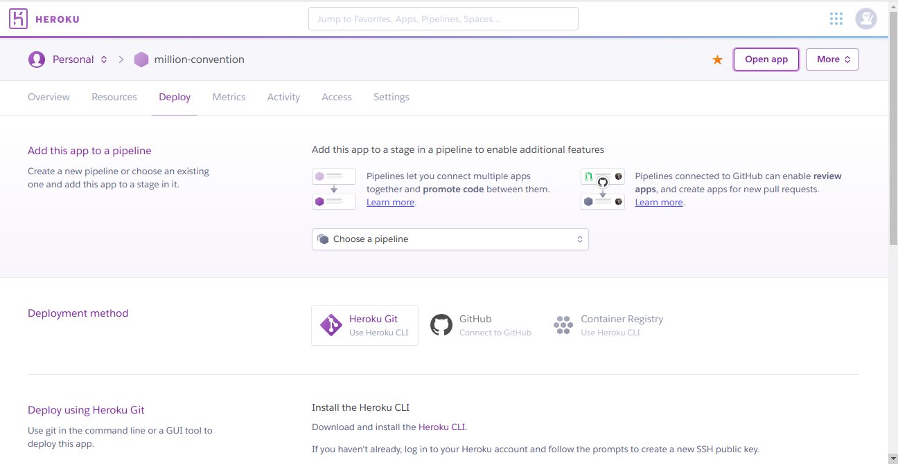
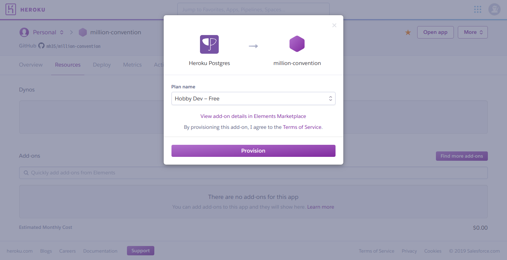

# Heroku+Railsでコンベンションセンター もどきを作ってみた

著:MH35

私は、THE@TER CHALLENGE対策として、コンベンションセンターもどきを立ち上げてみることにした。まあ結論から言えば、全然間に合わず、そして多忙もあり完成するよりも前に終わったわけだが。とはいえ、一応、備忘録として作り方を説明しておく。

## まずは登録

登録するために、まずは https://jp.heroku.com/home にアクセスをする。すると、以下のような画面にたどり着くだろう。

では、新規登録をクリックしよう。そして、必要な情報を入力した後、無料アカウント作成ボタンを押して登録を完了する。この情報は後で使うので覚えておこう。

必要に応じて、メールアドレスの認証を済ませてしまおう。

次に、クレジットカード情報の登録を行う。ログイン後、右上のアカウントアイコンをクリックし、Account settingsに進む。その後、Billingを開き、クレジットカード情報を登録する。

## アプリケーションを作成する

アプリケーションを作成するには、ダッシュボードのトップから、Newを選び、Create new appを選ぶ。

すると、アプリ名とオーナー、設置する地域を求められる。アプリ名は、あとでURLにも出てくるが、全アカウントでユニークである必要がある。今回はmillion-conventionという名前にしたが、要するに自分のアプリの名前を選べばよい。オーナーは特にこだわりがなければ自分個人に紐付ければよい。また、地域もアメリカ合衆国で問題ないだろう。Create appボタンを押してアプリを作成する。

その後、以下のような画面が出てくるはずである。

今回はGitHubに紐付けるのでGitHubを選ぶ。おそらく初回はまずは認可せよと要求が来るはずである。所定の手順に従って認可をする。すると、レポジトリを選べとなるので、レポジトリを検索し、選ぶ。その後、Connectボタンを押すとそのレポジトリが紐づく。その後、自動デプロイするブランチを選び、Enable Auto Deployボタンを押すことで、自動デプロイが実行できるようになる。

## DBサーバを紐付ける

DBサーバはHeroku Postgresを使った。まずはResourcesを開き、Add-onsからpostgresと検索するとHeroku Postgresが出てくるので、それをクリックすると、以下のような画面になる。

実運用前に移行はするので、Hobby Devでよい。それを選びProvisionする。

同様の手順でHeroku Redisも紐付ける。

その後は、通常どおりアプリを開発し、GitHubにpushをしていく。データベースのマイグレーションは、MoreからRun consoleを選び、rake db:migrateを実行するだけである。

なお、一度pushしたあと、独自ドメインを使う場合は、ドメインの紐付けをしたあと、Dynoをhobbyにする。hobbyは7ドル/月である。

データベースの移行は、新たにHobby Basic(9ドル/月)でHeroku Postgresを借りて、以下のような手順を踏む

1. 環境変数を確認する
2. Run consoleからmaintenance:onを実行する
3. Run consoleからpg:copyを実行する
4. Run consoleからpg:promoteを実行する
5. Run consoleからmaintenance:offを実行する
6. 古いHeroku Postgresアドオンを廃棄する

詳細な手順は https://devcenter.heroku.com/articles/upgrading-heroku-postgres-databases にあるのでそれを参照せよ。

## やらかしたこと

あまりにスピード感がなさすぎて、大勢が決したあとにようやく管理機能が最小限出来上がった状態であった。結果、もはや不要になったとなれば、わざわざ維持管理するコストを払うこともできず、結果としてさっさと捨てるという決断になってしまった。