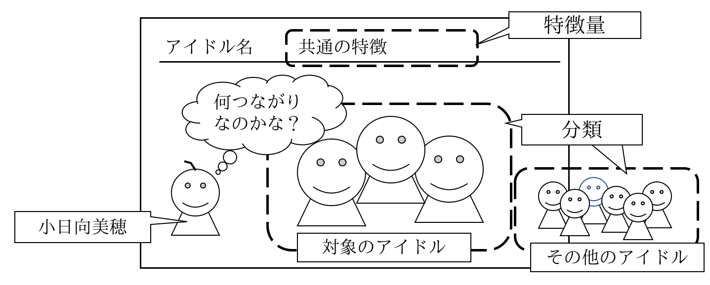
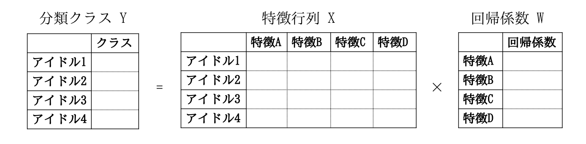
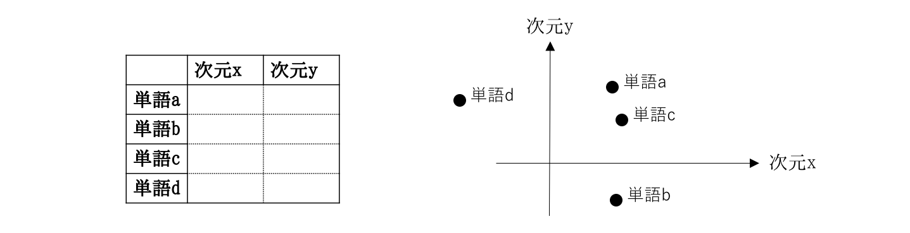
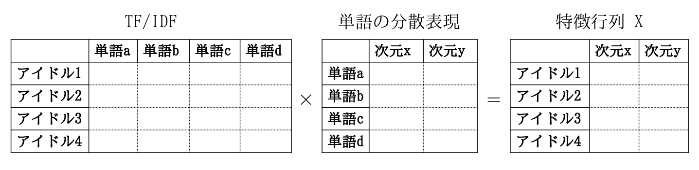

# 何つながりなのかな？を探る自然言語処理<br><span class="subtitle">～765PRO LIVE THEATERに通りがかる小日向美穂～</span>
<p class="right">著:みかみん</p>

このチャプターでは、自然言語処理という面からアイドルマスターの楽しみ方を提案します。

アイドルマスターシリーズには多くのアイドルが登場し、またアイドル同士が会話する場面も登場します。組み合わせのパターンは非常に多くなりますが、組み合わせによってどんな会話が行われるかを想像し、二次創作することもアイマスの楽しみ方の一つです。そんな組み合わせによる会話のテーマを、自然言語処理で探ることもアイマスの楽しみ方に加えてみてはいかがでしょうか。

デレステには「何つながりなのかな？」と考えながら小日向美穂が通りがかる１コマ劇場がありますが。ここでは自然言語処理を使って、複数のアイドルたちの共通の特徴「何つながりなのかな？」を探っていきます。


## 共通の特徴を探る方法

「何つながりなのかな？」を探るための考え方を順に説明します。


### ロジスティック回帰

まず、データサイエンスの視点で「何つながりなのかな？」の問題を解く方法を考えてみます。


<center>図1. 「何つながりなのかな？」１コマ劇場の情報</center><br />

「何つながりなのかな？」の１コマ劇場を見ると、「共通の特徴」と「対象のアイドル」の情報があります。これは、「共通の特徴」によって「対象のアイドル」と「それ以外のアイドル」を分類する問題と考える事ができます。

「共通の特徴」を探るためには、この分類を行う予測モデルをロジスティック回帰によって構築し、その回帰係数をみると、アイドルのどの特徴がどの程度分類に影響を与えたかがわかります。


<center>図2. ロジスティック回帰による分類と回帰係数</center><br />

図2に示すデータは、以下の通りです。

- アイドル分類クラス Y : 対象のアイドルには1、その他のアイドルの場合以外に0の値を持つベクトル
- アイドル特徴行列 X : 行に各アイドル、列にアイドルの特徴を持つ行列
- 「何つながりなのかな？」回帰係数 W : 各特徴が与える分類への影響

予測モデルの構築のために「アイドル特徴行列 X」「アイドル分類クラス Y」のデータを入力とし「回帰係数ベクトル W」を求めます。この回帰係数の大きさを見ると、それぞれの特徴がどの程度影響を与えたかがわかります。（「アイドル特徴行列 X」と「回帰係数 W」の内積をとると、分類クラスへの所属確率を求めることが出来ます）


### TF-IDF

次に、自然言語処理によって、ここまでの説明で出てきた数値で表現されたアイドルの特徴を求めることを考えます。

アイドル毎にその特徴を説明するテキストが存在する場合、TF-IDFという指標で、各アイドルの特徴を示す単語の重要度を示すことが出来ます。TF-IDFとは、単語の出現頻度(TF=Term Frequency)と逆文書頻度(IDF=Inverse Document Frequency)に基づく指標です。


<center>図3. TF-IDFの求め方</center><br />

図3に示すように、文章毎の各単語の出現回数、各単語が出現した文書数から求めることが出来ます。TFは、(文章毎の各単語の出現回数)÷(文章毎ののべ単語数)。IDFは、(総文書数)÷(各単語が出現した文書数)の対数です。TF-IDFは、これらを掛けたものになります。

TFでは、あるアイドルのテキストを見たときに多く含まれる単語の重要度が上がり、逆に少ない単語の重要度は下がります。IDFでは、どのアイドルにも出現する単語は重要度が下がり、特定のアイドルのみに出現する単語は重要度が上がります。あるアイドルのテキストの中で頻繁に出現し、特定のアイドルのみにしか出現しない単語をもっとも重要と判断する事になります。

行をアイドル、列を単語、その要素をTF-IDFとして「アイドル特徴行列 X」とすることも出来ますが。次のような課題があるため、次の項で説明する単語の分散表現を組み合わせてアイドルの特徴行列を求めることにします。

- 単語の種類分の次元をもつため高次元になりやすい
- 同じ単語が出現しなければ共通の特徴を抽出できない（似た単語を考慮できない）


### 単語の分散表現

単語の分散表現とは、低次元のベクトルによる単語の表現方法です。


<center>図4. 単語の分散表現のイメージ</center><br />

図4では、単語a〜dを、次元x,yという2次元のベクトルで表現しています。右図のような次元x,yで作られた空間に単語を配置すると、「単語d」と「単語a,c」は次元xでは似ていないが、次元yでは似ているということがわかりやすいです。このように、分散表現を用いると単語同士がどのような次元で似ているかを知ることが出来ます。

次に、単語の分散表現を用いて「アイドル特徴行列 X」を作ることを考えます。図5のように、TF-IDFと単語の分散表現の内積をとると、単語の分散表現で示される次元でアイドルを表現することが出来ます。


<center>図5. 単語の分散表現による特徴行列</center><br />

図5に示すデータは、以下の通りです。

- アイドルのTF-IDF行列 : 行に各アイドル、列に単語、要素にTF-IDFを持つ行列
- 単語の分散表現行列 : 行に単語、列に次元、要素に次元毎の重みをもつ行列
- アイドル特徴行列 X : 行に各アイドル、列に分散表現の次元を持つ行列


## 実際のデータへの適用

それでは、実際のデータに対して、ここまで説明した考え方を適用していきます。

利用した言語・ライブラリは、次の通りです。

- Python 3.6.8
- Janome 0.3.7 https://mocobeta.github.io/janome/
- scikit-learn 0.20.2 https://scikit-learn.org/
- gensim 3.7.0 https://radimrehurek.com/gensim/

### 対象データ

対象とするアイドルは、ミリオンライブに登場する52人のアイドルとします。

各アイドルを説明する文章のデータは「ニコニコ大百科」と、ファンサイト等から集めたアイドルの台詞テキストを用いました。

- ニコニコ大百科 https://dic.nicovideo.jp/

単語の分散表現は、次のURLで公開されている、Word2VecによってWikipediaの文章を学習させた、約5万単語、300次元の分散表現を用いました。

- Pre-trained word vectors https://github.com/Kyubyong/wordvectors

### TF-IDF

各アイドルのTF-IDFは、次の通りになりました。アイドル毎にTF-IDFの値が大きい単語から順に並べています。

```
天海春香: 春香(0.42), 閣下(0.42), アイドル(0.14), ある(0.11), キャラクター(0.11), 公式(0.11), みんな(0.10)
如月千早: 千早(0.42), 如月(0.20), ある(0.17), なる(0.17), ネタ(0.13), ボーカル(0.10), 公式(0.10)
星井美希: ミキ(0.66), ハニー(0.17), シナリオ(0.13), アイドル(0.11), 移籍(0.09), プロ(0.08), ムーン(0.07)
萩原雪歩: ある(0.12), ネタ(0.10), リンゴ(0.10), 貴女(0.10), ちゃんと(0.09), ゆき(0.08), ふる(0.08)
高槻やよい: なる(0.15), ハイ(0.14), ある(0.12), みんな(0.11), 一緒(0.11), アイドル(0.10), ごはん(0.10)
菊地真: ボク(0.77), まく(0.09), アイドル(0.08), ある(0.07), バリバリ(0.07), キミ(0.07), パワー(0.07)
水瀬伊織: アンタ(0.38), バラ(0.22), ちゃん(0.19), ジュース(0.13), アイドル(0.09), みかん(0.08), この(0.08)
四条貴音: アイドル(0.22), あなた(0.21), ある(0.20), 四条(0.19), ふる(0.15), この(0.11), 本日(0.11)
秋月律子: アイドル(0.19), ふる(0.15), 眼鏡(0.14), スレ(0.13), 私服(0.11), プロ(0.10), 事務(0.09)
三浦あずさ: あずさ(0.21), なる(0.16), ふる(0.16), アイドル(0.15), 三浦(0.14), ある(0.11), カフェ(0.11)
双海亜美: ふる(0.06), うく(0.05), プリン(0.04), よし(0.04), この(0.04), アイドル(0.04), イタズラ(0.03)
双海真美: ジャングル(0.06), ふる(0.06), パフェ(0.05), アイドル(0.05), なる(0.04), 千早(0.03), ついに(0.03)
我那覇響: 自分(0.38), アイドル(0.18), クマ(0.15), サイズ(0.13), なる(0.11), マスター(0.09), みんな(0.09)
春日未来: アイドル(0.19), ギター(0.19), あじさい(0.17), 春日(0.14), ジュリア(0.13), この(0.12), なる(0.12)
最上静香: アイドル(0.18), この(0.14), パンダ(0.13), ロック(0.13), 態度(0.12), 最上(0.11), みんな(0.11)
伊吹翼: 今日(0.11), ダメ(0.10), アイドル(0.09), みんな(0.09), トップ(0.08), いま(0.07), 自由(0.07)
田中琴葉: 合流(0.24), アイドル(0.18), 灼熱(0.17), なる(0.15), エレナ(0.12), 少女(0.11), 面目(0.11)
島原エレナ: ワタ(0.76), ショ(0.17), エレナ(0.13), みんな(0.13), ブラジル(0.11), 一緒(0.08), サッカー(0.07)
佐竹美奈子: みんな(0.16), ハロウィン(0.09), なる(0.09), ドリンク(0.09), プロデューサー(0.08), 水分(0.08), アイドル(0.08)
所恵美: なる(0.12), ビーチバレー(0.11), ある(0.09), みんな(0.08), 進行(0.07), アイドル(0.07), いい(0.07)
徳川まつり: まつり(0.58), ナイト(0.14), 活躍(0.10), なる(0.10), キノコ(0.09), みんな(0.09), 招待(0.08)
箱崎星梨花: イベント(0.17), パパ(0.13), 最上(0.13), なる(0.11), カード(0.11), 春日(0.10), アイドル(0.09)
野々原茜: ちゃん(0.85), プロ(0.08), 注目(0.07), 今日(0.06), アイドル(0.06), ゾンビ(0.05), 人形(0.05)
望月杏奈: テンション(0.10), 魔王(0.09), サンタ(0.06), アイドル(0.06), 騎士(0.06), 今日(0.05), 一緒(0.05)
ロコ: アート(0.19), 本名(0.11), アーティスト(0.08), アイディア(0.07), セット(0.07), ナイス(0.05), サプライズ(0.05)
七尾百合子: 妄想(0.17), なる(0.17), ある(0.15), 世界(0.13), この(0.13), ページ(0.12), 百合子(0.12)
高山紗代子: 眼鏡(0.22), 高山(0.12), なる(0.10), 一緒(0.10), ふる(0.10), 花火(0.10), そば(0.10)
松田亜利沙: ある(0.45), アイドル(0.39), ゾンビ(0.14), 署名(0.09), データ(0.08), ポーズ(0.07), 情報(0.07)
高坂海美: 女子(0.17), ねる(0.12), よる(0.11), 全力(0.10), どう(0.09), ない(0.09), 全開(0.09)
中谷育: サラダ(0.13), ちゃんと(0.08), きょう(0.08), みんな(0.07), アニメ(0.07), ちゃん(0.07), なる(0.06)
天空橋朋花: 聖母(0.62), 騎士(0.22), ふる(0.18), あら(0.15), ある(0.12), 天空(0.09), 魔術(0.09)
エミリー: エミリー(0.09), 日本(0.08), 抹茶(0.07), とても(0.06), スチュアート(0.06), 菓子(0.05), 反骨(0.05)
北沢志保: ある(0.18), あまり(0.14), 父親(0.11), この(0.11), ふる(0.10), 記憶(0.10), なる(0.10)
舞浜歩: ダンス(0.23), アメリカ(0.21), ヘビ(0.09), なる(0.09), アイドル(0.09), 英語(0.07), つく(0.06)
木下ひなた: あたし(0.83), りんご(0.19), なる(0.13), アイドル(0.10), みんな(0.09), 社長(0.06), クマ(0.05)
矢吹可奈: らん(0.16), クラリネット(0.15), なる(0.13), アイドル(0.12), この(0.10), しん(0.10), みんな(0.10)
横山奈緒: キング(0.21), 大阪(0.14), なる(0.10), 一緒(0.09), アニキ(0.09), みんな(0.09), 今日(0.09)
二階堂千鶴: セレブ(0.16), 高貴(0.11), この(0.07), ある(0.06), アイドル(0.06), 二階堂(0.06), 感謝(0.06)
馬場このみ: セクシー(0.43), 魅力(0.14), 大人(0.12), アイドル(0.12), 女性(0.11), なる(0.10), 馬場(0.08)
大神環: ふる(0.13), ぶる(0.05), みんな(0.04), レッド(0.04), スカート(0.03), 一緒(0.03), サル(0.03)
豊川風花: ふる(0.24), セクシー(0.19), アイドル(0.18), なる(0.17), 正統(0.15), キング(0.13), いい(0.12)
宮尾美也: とっても(0.24), 今日(0.11), なる(0.11), アイドル(0.11), みや(0.10), サンドイッチ(0.10), 人魚(0.10)
福田のり子: バイク(0.13), いい(0.11), スクーター(0.10), なる(0.08), アイドル(0.08), ヒロイン(0.07), ホント(0.07)
真壁瑞希: 手品(0.20), 表情(0.19), はい(0.12), この(0.11), マジック(0.11), 特別(0.10), スパイス(0.10)
篠宮可憐: 緊張(0.21), リラックス(0.14), できる(0.12), くる(0.11), いい(0.09), ハーブ(0.09), 敏感(0.09)
百瀬莉緒: キミ(0.16), 魅力(0.11), ある(0.10), いい(0.10), どう(0.10), サービス(0.09), 年長(0.09)
永吉昴: オレ(0.88), 野球(0.17), キャッチボール(0.07), みんな(0.07), なる(0.06), いい(0.06), アイドル(0.05)
北上麗花: ふる(0.24), 普通(0.15), パジャマ(0.14), なる(0.12), 修理(0.12), 煙突(0.12), 北上(0.10)
周防桃子: クマ(0.09), ちゃんと(0.06), この(0.05), アイドル(0.05), みんな(0.05), わかる(0.04), いい(0.04)
ジュリア: あたし(0.71), ジュリア(0.19), ロック(0.17), ウチ(0.10), ある(0.08), アイドル(0.08), ギター(0.08)
白石紬: あなた(0.26), アイドル(0.16), うち(0.14), ある(0.14), この(0.12), 事件(0.11), なる(0.10)
桜守歌織: アイドル(0.24), なる(0.23), ふる(0.19), ある(0.15), とっても(0.12), この(0.12), 大人(0.11)
```

アイドルを示す特徴的な単語が確認できます。

### 「何つながりなのかな？」の考察

次に、「何つながりなのかな？」を考察します。

既に説明した通り、TF-IDFと単語の分散表現から求めた、アイドル特徴行列を使います。分類クラスは、任意に対象アイドルを組み合わせて選ぶ事が可能ですが、ここでは、七尾百合子と誰か一人という組み合わせ51パターンを求めました。

ロジスティック回帰によって学習した回帰係数ベクトルは、単語の分散表現の次元に対応します。回帰係数ベクトルからみてコサイン類似度が高い単語を、分散表現を持つ約5万単語から選んで並べています。

```
七尾百合子x天海春香: 幻想,怪奇,ファンタジー,作品,ものの,アンソロジー,エロス,ショートストーリー,推理,ホラー,少女,短篇,ものを,珠玉,魅惑
七尾百合子x如月千早: ノンフィクション,フィクション,ボードレール,幻想,なる,エロス,忘却,推理,アンソロジー,ファンタジー,ドストエフスキー,世界,論考,カフカ,のなかで
七尾百合子x星井美希: シナリオ,考察,ことばの,軌跡,論考,ノンフィクション,コピーアンドペースト,プロット,ページ,原論,タイムトラベル,ストーリー,推理,連載,大著
七尾百合子x萩原雪歩: 恐怖,妄想,コンテンツアイコン,レイプ,怪奇,ショートストーリー,ウィザードリィ,エドガーアランポー,幻想,謎,忘却,少女,密室,ラブレター,コンテンツアイコンセクシャル
七尾百合子x高槻やよい: にあるように,になっています,たとえば,目次,なる,にあるとおり,にあるような,にまとめた,サブページ,全角,文章,著者,ですし,ですが,あるいは
七尾百合子x菊地真: ボク,ミステリー,のなかの,コンテンツアイコン,ぼくらの,のゆくえ,たち,推理,幻想,なぜ,エロス,軌跡,少女,のはじまり,のことば
七尾百合子x水瀬伊織: 著者,バラ,エドガーアランポー,アルセーヌルパン,作家,メルヘン,妖精,ミステリ,短篇,詩集,ものを,いちご,スタンダール,童話,著書
七尾百合子x四条貴音: 年代記,迷宮,アトランティス,ジュールヴェルヌ,エドガーアランポー,といわれる,ある,ファンタジー,奇譚,古代,夢幻,よみがえる,文明,のうちでも,ものの
七尾百合子x秋月律子: 推理,テクノロジー,世界,ジュールヴェルヌ,知識,最新,試論,空想,宇宙,思索,思考,ノンフィクション,カルテ,バイオテクノロジー,論考
七尾百合子x三浦あずさ: 推理,少女,わたしの,迷宮,ダイアリー,殺人,密室,夢幻,恋,ファンタジー,殺意,幻想,エッセイ,メルヘン,なかよし
七尾百合子x双海亜美: 破片,そこから,のようにして,してしまうので,をおこす,してできる,ワームホール,とそれを,はたとえば,らせん,だとした,エレメント,軸索,としを,させることにより
七尾百合子x双海真美: アドベンチャー,軌跡,カッパノベルス,迷宮,カドカワノベルズ,文庫,のによる,せよ,ノベルス,ふたたび,時空,イーストプレス,長篇,にとして,ぼくらの
七尾百合子x我那覇響: 妄想,著者,推理,作者,妖怪,人間,前世,謎,ノンフィクション,アガサクリスティ,ホームズ,ラヴクラフト,なぜ,カフカ,自分
七尾百合子x春日未来: 迷宮,狩人,わたしの,ぼくらの,夢幻,名曲,のうた,星空,ファウスト,パラダイス,推理,篇,アドベンチャー,短篇,ぼくの
七尾百合子x最上静香: 人生,ニーチェ,ファウスト,それは,それでも,妄想,悲劇,オカルト,そして,なぜ,ニーバー,エッセイ,ぼくの,幻想,世相
七尾百合子x伊吹翼: 選集,分冊,短篇,傑作,元版,群像,のなかの,ミステリー,冊,名著,ワック,長篇,怪奇,新版,三巻
七尾百合子x田中琴葉: エロス,合流,軌跡,幻想,紀行,少女,ドキュメント,をまとめた,迷宮,怪奇,カフカ,遭遇,アンソロジー,改題,をまとめたもの
七尾百合子x島原エレナ: ワタ,アイスランド,ブラジル,チュニジア,アンゴラ,パプアニューギニア,チェコ,スペイン,モロッコ,タミル,イタリア,ジャマイカ,ナイジェリア,シュメール,エストニア
七尾百合子x佐竹美奈子: 糖分,食物,糖質,含量,ナイアシン,エキス,深層,粉食,脂肪,知性,糞尿,キャッサバ,輸液,カロリー,白米
七尾百合子x所恵美: なる,についての,においてこの,にはこのような,なつの,のさまざまな,であるとしている,のひとつの,なるの,をおこす,なるという,であるのか,にみられる,でさまざまな,なりは
七尾百合子x徳川まつり: まつり,殺人,夢幻,コンテンツアイコン,迷宮,怪奇,のなかの,のはじまり,紀行,幻想,りぼん,よみがえる,奇譚,へようこそ,まつりが
七尾百合子x箱崎星梨花: 累計,特典,アニメイト,カード,ページ,迷宮,カルテ,ライフ,ベット,プレミアム,クエスト,プチゲーム,シリーズ,ぴあ,スペシャル
七尾百合子x野々原茜: ちゃん,くん,ぼくの,ちゃんの,怪奇,少女,ぼくらの,推理,コンテンツアイコン,とと,ものの,よみがえる,殺人,ひみつの,ちゃんで
七尾百合子x望月杏奈: ガノンドロフ,ムドー,ダオス,クッパ,リィンバウム,アバタール,アルテア,ナイブズ,妖魔,アーカード,マグニートー,魔王,バラモス,もろとも,ロックオン
七尾百合子xロコ: 試論,論考,アート,ページ,テクスト,原論,大著,草稿,文章,ノンフィクション,にまとめた,散文,書籍,手稿,モデリング
七尾百合子x高山紗代子: 眼鏡,夢,少女,シャナ,妖精,眼,夢幻,迷宮,コンテンツアイコン,人魚,原題,蠅,りぼん,幻,つめる
七尾百合子x松田亜利沙: ある,ルポルタージュ,エッセイ,ドキュメント,短篇,ものを,ノンフィクション,アンソロジー,をまとめた,情報,カルテ,珠玉,推理,怪奇,レポート
七尾百合子x高坂海美: ではもう,ことばの,させるほどの,ないの,推理,ありで,ものは,しだけ,スピード,ではかなり,テクニック,のなかで,もう,をもう,でもかなり
七尾百合子x中谷育: しよう,にっぽん,わたしの,になりまた,されそして,ぼくらの,されていき,したりまた,こころの,によるの,でによる,のしくみ,などなどの,のみとなり,にまとめた
七尾百合子x天空橋朋花: 聖母,幻想,聖杯,エロス,コンテンツアイコン,ダンテ,夢幻,迷宮,マザーテレサ,忘却,聖女,のなかで,天使,詩集,受難
七尾百合子xエミリー: 試論,論考,集成,彙,現代,全書,註解,小史,原論,のなかで,地誌,思想,漢文,選集,においてである
七尾百合子x北沢志保: あなたの,記憶,つまりこの,かもしれない,それは,ある,いろいろ,カルテ,クオリア,しよう,なぜ,エロス,イブ,妄想,レム
七尾百合子x舞浜歩: アメリカ,イギリス,ラテンアメリカ,フランス,オーストラリア,カナダ,ヨーロッパ,イギリスアメリカ,ドイツ,アイルランド,イタリア,パプアニューギニア,大陸,幻想,エストニア
七尾百合子x木下ひなた: あたし,ゲ,ャ,ペ,ン,ァ,ヴ,ォ,殺人,をたずねて,ィ,ベ,もうひとつの,ナ,ゼ
七尾百合子x矢吹可奈: 全曲,ワーグナー,組曲,ムソルグスキー,曲集,バルトーク,忘却,音型,ファウスト,コンチェルト,五重奏曲,ロンド,序奏,ピアノソロ,シンフォニー
七尾百合子x横山奈緒: のとある,にてこの,のという,ちなみにこの,大阪,イソップ,であるこの,このつの,ぼくらの,などにある,ウィザードリィ,がらみの,二十面相,ということになっている,からきた
七尾百合子x二階堂千鶴: 富裕,ノンフィクション,富豪,ナショナリズム,幻想,高貴,のなかで,高級,多作,バイロン,政治,のなかでも,にあって,モダニズム,崇高
七尾百合子x馬場このみ: 殺人,少女,推理,レイプ,怪奇,女性,セクシー,ノンフィクション,愛憎,いじめ,作家,たち,妄想,男性,ストーカー
七尾百合子x大神環: にみる,のなかの,叢書,頁,のなかで,大系,にあって,紀行,選集,をのぞき,奇談,にあっても,からみた,のち,において
七尾百合子x豊川風花: なぜ,のなかで,幻想,のゆくえ,まんが,怪奇,空想,ものの,それは,のなかの,のことば,ファンタジー,のはじまり,オカルト,もっと
七尾百合子x宮尾美也: 生物,動物,病態,血液,ウィキポータル,それらは,マクロファージ,たとえば,ページ,深層,カルテ,ものを,あるいは,病理,胃
七尾百合子x福田のり子: シリーズ,これまでの,でいきなり,なぜ,ファイアーエムブレム,せよ,されたのか,そして,軌跡,原題,ハーデス,のところで,よみがえる,文藝,のすべて
七尾百合子x真壁瑞希: 幻想,推理,怪奇,超絶,トリック,悲劇,エロス,ノンフィクション,悲哀,ものを,のなかで,思考,空想,ファウスト,のはじまり
七尾百合子x篠宮可憐: 緊張,焦燥,恐怖,妄想,憂鬱,異常,のあまり,をもたらす,怪奇,奇異,敏感,倦怠,にさらされる,エロス,幻想
七尾百合子x百瀬莉緒: なんだと,のことば,ですね,かもしれないと,でしたと,だろう,ちょっと,かもしれない,あなたの,もっと,そう,たち,あなたは,であるとも,はいま
七尾百合子x永吉昴: オレ,なぜ,奇譚,たちひょうきん,ぼくらの,原題,マンガ,さらば,コンテンツアイコン,へようこそ,のことば,短篇,妄想,まんが,てれびくん
七尾百合子x北上麗花: 夢幻,絶景,殺人,小屋,ミステリー,吹雪,遭難,摩耶,幻想,古城,激突,殺意,炎上,恋,紅蓮
七尾百合子x周防桃子: 推理,作家,によれば,治,雄,とはいえ,之,だったのだが,彦,詩人,といわれ,はこのとき,聰,史,ノンフィクション
七尾百合子xジュリア: あたし,ヴ,試論,フ,ォ,のなかで,ャ,ァ,世界,論考,ィ,吟遊,ュ,幻想,現代
七尾百合子x白石紬: なぜ,推理,はなぜ,ですから,事件,殺人,のなかの,なのか,であるとし,コンテンツアイコン,がなぜ,あなたは,はいかにして,であるのか,のなかで
七尾百合子x桜守歌織: のなかの,わたしの,のなかで,幻想,こころの,のゆくえ,のことば,にみる,わが,選集,をこえて,もうひとつの,紀行,のはじまり,のうた
```

TF-IDFの結果から、七尾百合子といえば「妄想」という事が分かりますが。アイドルを組み合わせてみると、組み合わせによって「妄想」の方向性が変わっていることが確認できます。

当てはまっているもの、そうでないものもありますが。七尾百合子と誰かが話をしている場面を想像すると、ここで上げた単語のような話題で会話をしているイメージになると考えられます。

## おわりに

このチャプターでは、自然言語処理を用いて、アイドル同士の「何つながりなのかな？」を探ってみました。

中の人が765PRO LIVE THEATERに通りがかると「お前はミリオン、そして私はシンデレラ」(\*1)ですが、小日向美穂が通りがかると、アイドルの組み合わせでいろいろな想像をすることが出来ます。組み合わせはいろいろと作ることが出来るので、ここで紹介したパターン以外も試してみていろいろな考察や想像をしてみるのも、楽しいかと思います。

<footer>\*1 : 小日向美穂役の津田美波さんが、アイドルマスター年越し特番「ゆくM@S くるM@S 2016」に出演した際に残した迷言</footer>
<footer>\*2 : 箱崎星梨花役の麻倉ももオフィシャルブログ「もちょっとおしゃべり」恒例の締め言葉</footer>

終わりだよ〜(\*2)
