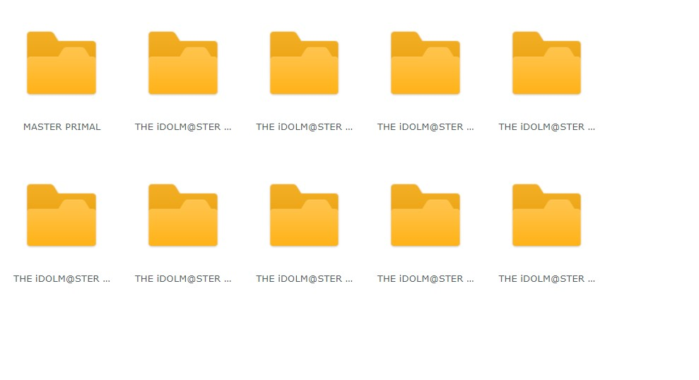
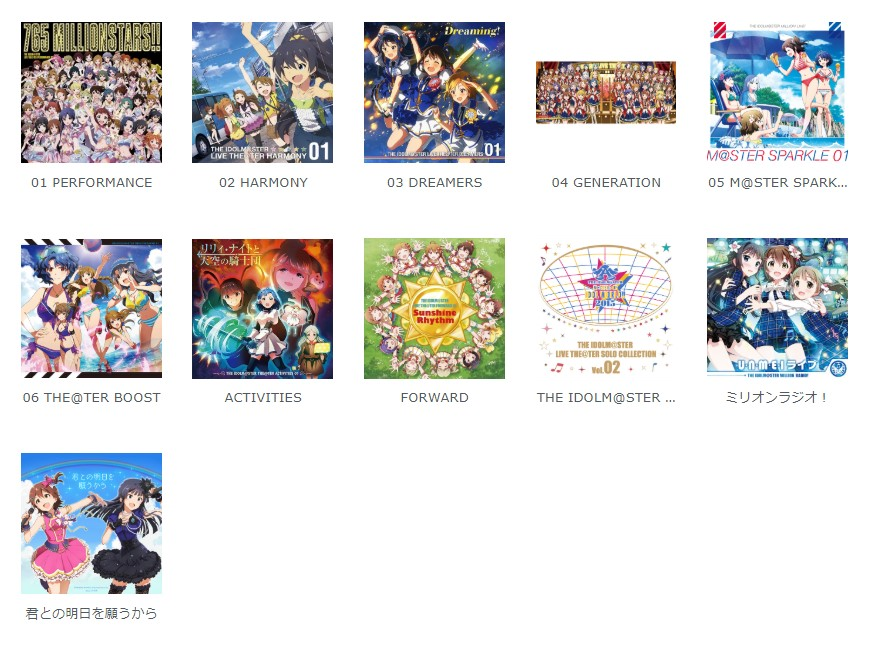
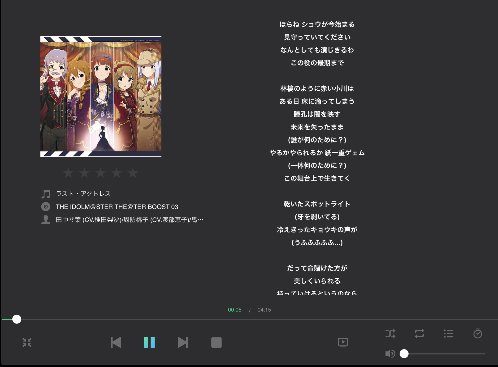
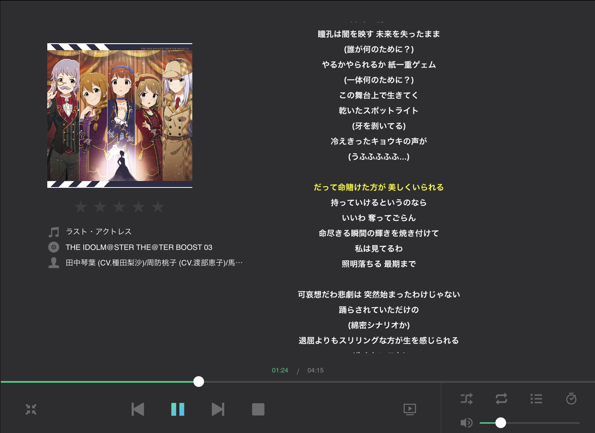

# 増え続けるアイマス楽曲をNASで一括管理

著:Wakuwaku

## はじめに

### このChapterを読むにあたっての注意点

- コード一切なし
- NASの導入手順等の説明なし
- NASを買っただけ

### 対象者

- NASの購入検討中の方
- SynologyのNASを使っているが`Audio Station`を使ってない方

## 問題

iPad Proを購入する際に安いモデルにしたら曲入れる余裕がない。
もともとiPhoneにも入りきらない。

## 解決方法

NASで一括管理して全デバイスで参照できるようにする。

## 準備

- NAS
  Synology, QNAPなどの高機能なNASを買う必要がある。
  ここではSynology社のDS918+を使う。

## 実践

NASのセットアップについてはここで説明するより公式のサポートを見てほしい。

NASに導入するアプリケーションは以下の通りだ。

- Audio Station
  - NASの標準プレイヤー
  - ブラウザで再生できる
  - Android, iOS, WindowsPhone向けアプリがある

必要なら以下も導入してほしい。

- iTunes Server
  - PCで再生するときに使用する
- MinimServer
  - DLNAサーバー
  - DLNA対応プレイヤーの時に使う時に捗りそう

### ディレクトリ構成を考える

一般的なメディアライブラリのディレクトリ構成は以下のようになっている。

`~/{アーティスト}/{アルバム}/{トラック} {曲名}.flac`

しかしこれをアイドルマスターで作る場合を考えると以下の問題が出てくる。

- アルバム数が異常に多い
- 同じようなアルバム名がたくさんある

そこで、私はアルバム名の単語で分ける事にした。

MA3の場合は以下のようになる。

`~/THE IDOLM@STER/MASTER/ARTIST 3/01 天海春香1/00 PROLOGUE/01 ONLY MY NOTE (M@STER VERSION).flac`

私のここ最近のお気に入り`ビックバンズバリボー!!!!!`では以下のようになる。

`~/THE IDOLM@STER/THE@TER/BOOST/01 ビックバンズバリボー/02 ビックバンズバリボー (M@STER VERSION).flac`

このようにすることでpathが長くなりすぎる問題を解消できる。

ここで挙げているのは正解ではない。
個人で目的のファイルへのアクセスしやすいようにディレクトリ構成を作ってほしい。

### フォルダ画像の設定

`Audio Station`で管理する場合フォルダ画像を設定できる。

設定しない場合フォルダ表示は地獄だ。
これではどこに何が入っているか全くわからない。

そこで、フォルダ画像の設定をする。
フォルダ画像は各フォルダに`Folder.jpg`を設置する。
大きすぎても読み込みが遅くなるのでほどほどに400×400くらいにしておく。

設定したら何が入っているか一目瞭然だ。

### 歌詞の設定

アイマスを楽しむには歌詞を見れると考察が捗る。
NASを導入するまでタグに歌詞情報入れていた。
`Audio Station`はタグでは歌詞を読み込んでくれない。
`{ファイル名}.lrc`としたテキストファイルを読み込む。
また、歌詞ファイルにはタイムタグを使うことができる。
タイムタグとは歌詞の各行の先頭に`[00:00.00]`というように[`分`:`秒`.`100ミリ秒`]といれることで歌詞の入りのタイミングを指定することができる。
対応しているソフトウェアでは歌詞の自動スクロールなどを行うことができる。

タイムタグの指定は手作業だと大変なのでツールを使う。
私の場合、NASを導入する前はWindows向けプレイヤーソフトの`foobar2000`で音楽を聴いていたため、プラグインの`Lyrics Panel`を使う。

プラグイン導入しパネルを設置したら、右クリックから`Edit Lyrics...`をクリックする。

開いた後、歌詞を手入力する。手入力することで歌詞を自分でしっかり読むことができる。
その後歌詞の行にカーソルを合わせ、タイミングを合わせて左上の`Synchronise selected line`をクリックする。

これで`{ファイル名}.lrc`を保存すれば歌詞の設定は完了だ。

### モバイル端末に DS Audio を導入

モバイル端末向けのアプリケーションを使うことでNAS上に作られた音楽ライブラリを利用することができる。
アプリケーションは各ストアで無料でダウンロードできる。
音楽をストリーミングで聴くことになるが、一度再生した曲はキャッシュに残る。
再度再生する場合はキャッシュからデータを取得するためそれほど帯域をつかうわけではない。
また、ファイルを事前にダウンロードすることもできる。

### 【おまけ】 PC向けに iTunes Server、MinimServer を導入する

NASと同じネットワーク内にあるPCからは`iTunes Server`や`MinimServer`を使うこともできる。
インストールはNAS上のパッケージセンターで行うことができる。必要になったら使ってみてほしい。

また、上位モデルのNASではDockerを動かすことができる。
`bubbleUPnP`を動かしてみるのも面白いかもしれない。

## 終わりに

私の場合のアイマス楽曲の管理方法について書いてみた。
これで各プロデューサーの業務改善につながるとうれしい。