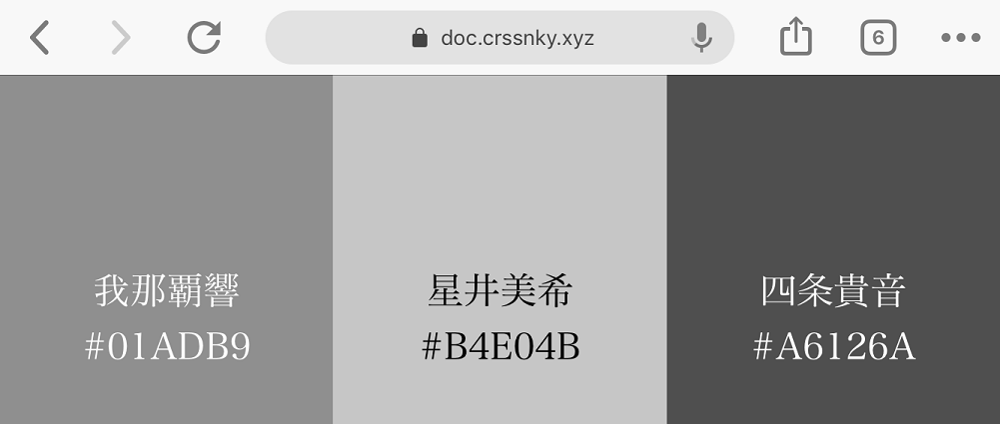
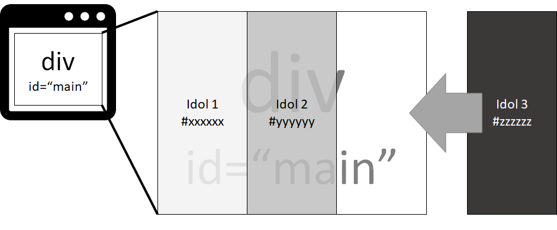

# im@sparql応用 ～HTMLでさっと表示編～
<p class="right">著:croMisa</p>

<!-- 定番にしていけ☆ -->
<center><big><big><big>im@sparql</big></big></big></center>
<center><big><big>im@s + sparql = im@sparql</big></big></center>
<center>広がるアイマスワールドをオープンデータ化</center>
<center>WebやアプリからSPARQLで検索・利用可能なエンドポイント</center>

## はじめに
im@sparqlは、現在も広がるアイマスワールドをデータベースという形で皆様のプロデュースの援助をしています。つまり、あるアイドルがどのようなプロフィールなのか、どのユニットに所属しているのか、着用可能な衣装は何か、などの情報が集められ、資源化されています。そして、それらはLinked Open Data(LOD)の形を取っています。そのため誰でもデータベースへアクセスすることができます。しかし、そのままでは使えません。**SPARQL**というクエリ言語を通じてアクセスする必要があります。  

先週号では、UE4のUnrealC++からim@sparqlへ問い合わせ、クエリ結果をゲーム内に反映するデモ(\*1)をお届けしました。  

今週は、クエリ結果の表現のキャンバスをHTMLにし、ユーザーの入力からクエリ内容を変化させる簡単なサンプルを作成していきます。完成イメージは図1のように、ユニットメンバーのイメージカラーが分かるようになります。  
<center><br/>
図1 完成イメージ</center>

<footer>\*1：https://github.com/crssnky/BP_imasparql_UE4</footer>

## 構成
今回は生のHTML+JS+CSSで書きます。説明の単純化が目的のため、デキる方は読み替えつつ、フレームワークなどを導入しても良いですね。  

以下に作成するファイルの配置を示します。と言っても、HTMLとJSとCSSを一つずつ作り、同じディレクトリに配置するだけです。ファイル名はお好きなものに替えてもらっても構いません。
```
Directory
  |--sample.html
  |--sample.js
  |--sample.css
```
完成品はこちら(\*2)です。ユニット名を入力して確定すると、im@sparqlへクエリを送ります。結果が返ってきたら画面いっぱいにユニットメンバーのイメージカラーが等分で並ぶようになっています。ちなみに、ユニット内にイメージカラーを持っていないアイドルは取得されず、イメージカラー有りのメンバーのみ取得されます。(例:`L.M.B.G`は専用ペンライトが発売されたアイドルのみ、イメージカラーが判明しています。そのため、表示されるアイドルは半分以下となっています。)  
<center><br/>
図2 動作イメージ</center>

<footer>\*2：https://doc.crssnky.xyz/imasparql/sample/sample01/index.html</footer>

## サンプルコード
### HTML
最初にガワであるHTMLを書いていきます。と言っても特殊なことはしません。CSSとJSを読み込み、入力欄と描画枠を記述するだけです。
```html
<!DOCTYPE html>
<html lang="ja">
<head>
  <title>sample</title>
  <link async rel="stylesheet" href="./sample.css">
  <script async src="./sample.js"></script>
</head>
<body>
  <div id="sub">
    <p>UnitName:</p>
    <input id="nameBox" type="text">
    <button onclick="exe(nameBox)">shoot</button>
    <p id="message"></p>
  </div>
  <div id="main" class="elements"></div>
</body>
</html>
```
`id=sub`の`div`タグは、ユニット名を入力するInputと確定ボタン、エラーメッセージのための`p`タグを最終的に隠すために、それらの親になっています。  
確定ボタンを押したら、Input要素をJavaScriptの関数に渡すようにします。  
`id=main`の`div`タグに、取得できた結果を格納していきます。

### CSS
今回は要素の横並びのために、`display: table`系を利用します。
```CSS
html {
  height: 100%;
  width: 100%;
}
body {
  height: 100%;
  width: 100%;
  margin: 0;
}
.elements {
  height: 100%;
  width: 100%;
  display: table;
}
.element {
  height: 100%;
  display: table-cell;
  vertical-align: middle;
  text-align: center;
}
```
画面いっぱいに表示したいため、`html`・`body`要素と`elements`・`element`クラスは縦横100%にします。また同様の理由で、`body`のマージンを0にします。  
上にも書きましたが、横並びさせるために`elements`クラスには`display: table`を記述します。また`elements`クラス内に格納される`element`クラスには、横並びされる側の`display: table-cell`を記述します。  
`element`クラスにはアイドル名とカラーコードをテキストでも表示したいため、テキストが真ん中に来るように`vertical-align: middle`と`text-align: center`も記述しておきます。

### JavaScript
今回の肝です。`XMLHttpRequest`オブジェクトを利用してクエリを投げ、受け取った文字列をJSONオブジェクトにし、Webページを非同期で更新していきます。一言で言えば、Ajaxします。
```JavaScript
function exe(unitName) {
  const Query = "PREFIX schema: <http://schema.org/>" + 
    "PREFIX rdf: <http://www.w3.org/1999/02/22-rdf-syntax-ns#>" + 
    "PREFIX imas: <https://sparql.crssnky.xyz/imasrdf/URIs/imas-schema.ttl#>" + 
    "PREFIX rdfs:  <http://www.w3.org/2000/01/rdf-schema#>" + 
    "SELECT ?iname ?color WHERE {?unit rdf:type imas:Unit;schema:name ?uname;" + 
    "schema:member ?member." + 
    "filter(?uname=\"" + unitName.value + "\")" + 
    "?member rdfs:label ?iname;imas:Color ?color.}order by ?member";
  const url = 'https://sparql.crssnky.xyz/spql/imas/query?query=' + 
              encodeURIComponent(Query);
  const request = new XMLHttpRequest();

  request.addEventListener("load", (e) => {
    const json = JSON.parse(e.target.responseText)["results"]["bindings"];
    if (json.length === 0) {
      document.getElementById("message").innerText = 
          "Not unit name. OR Each members don't has color.";
      return;
    }
    document.getElementById("sub").style = "display:none";
    const width = 100.0 / json.length;
    const div = document.getElementById("main");
    json.forEach(i => {
      const box = document.createElement("div");
      div.appendChild(box);
      box.classList.add("element");

      const name = i.iname.value;
      const color = i.color.value;
      box.style.width = width + "%";
      box.style.backgroundColor = "#" + color;
      box.style.fontSize = (width / 2) + "px";
      box.innerText = name + "\n#" + color;
      const red = parseInt(color.substring(0, 2), 16);
      const green = parseInt(color.substring(2, 4), 16);
      const blue = parseInt(color.substring(4, 6), 16);
      box.style.color = ((red * 0.299 + green * 0.587 + blue * 0.114) < 186) ?
                        "white" : "black";
    });
  });

  request.addEventListener("error", () => {
    console.log("Http Request Error");
  });

  request.open("GET", url);
  request.send();
}
```
順に説明していきます。  
最初に今回使用するSPARQLのクエリの雛形を宣言します。見やすくすると...
```SPARQL
PREFIX schema: <http://schema.org/>
PREFIX rdf:    <http://www.w3.org/1999/02/22-rdf-syntax-ns#>
PREFIX imas:   <https://sparql.crssnky.xyz/imasrdf/URIs/imas-schema.ttl#>
PREFIX rdfs:   <http://www.w3.org/2000/01/rdf-schema#>
SELECT ?iname ?color WHERE {
  ?unit   rdf:type       imas:Unit;
          schema:name    ?uname;
          schema:member  ?member.
  filter(?uname="[ユニット名]")
  ?member rdfs:label     ?iname;
          imas:Color     ?color.
}order by ?member
```
簡単に日本語へ翻訳すれば、「入力されたユニット名でユニットを検索し、そのユニットメンバーの名前とイメージカラーを取得する」というクエリです。`[ユニット名]`には、HTMLのinput要素内の文字列が入ります。  
また、GETメソッドでクエリを送るため、クエリをURIエンコードしたものをくっつけたURLを宣言します。`https://sparql.crssnky.xyz/spql/imas/query`はim@sparqlのエンドポイントですので、これに`?query=`パラメータとしてくっつけることでクエリを送ることができます。

次に`XMLHttpRequest`オブジェクトを生成し、レスポンスが返ってきた時のイベント処理を`addEventListener("load", ...`定義していきます。
```JavaScript
const json = JSON.parse(e.target.responseText)["results"]["bindings"];
```
ここ部分では、返ってきたテキストをJSONオブジェクトにし、結果が格納されている`["results"]["bindings"]`部を取得しています。この中の結果は、ユニットメンバー数分の名前と色が入っています。  
```JavaScript
if (json.length === 0) {
  document.getElementById("message").innerText = 
      "Not unit name. OR Each members don't has color.";
  return;
}
```
色を持つメンバーが居ない・ユニット名がマッチしない場合は結果の配列の長さが0になるため、if文でエラー処理をします。  
```JavaScript
document.getElementById("sub").style = "display:none";
```
表示する結果がある場合は、入力欄などを非表示にします。
```JavaScript
const width = 100.0 / json.length;
const div = document.getElementById("main");
```
横並びにする要素の横幅を決定します。簡単に等分しています。また、要素を格納するための親要素を取得します。
```JavaScript
json.forEach(i => {
  ・・・
});
```
結果の配列に対して、forEachループで処理していきます。
```JavaScript
const box = document.createElement("div");
div.appendChild(box);
box.classList.add("element");
```
ユニットメンバーを表現するための要素を生成します。クラスに`element`を追加し、子要素として追加します。
```JavaScript
const name = i.iname.value;
const color = i.color.value;
box.style.width = width + "%";
box.style.backgroundColor = "#" + color;
box.style.fontSize = width + "px";
box.innerText = name + "\n#" + color;
```
名前と色を分かりやすいように変数へ取り出し、先程生成した要素の見た目を整えていきます。横幅は等分した値、背景色はイメージカラー、フォントサイズも横幅に合わせて小さくします(\*3)。  
テキストには、分かりやすいように名前とカラーコードを入力します。

<footer>\*3：メンバー数が多いと、これだけでは対応できない。が、複雑になってしまうので割愛</footer>

```JavaScript
const red   = parseInt(color.substring(0, 2), 16);
const green = parseInt(color.substring(2, 4), 16);
const blue  = parseInt(color.substring(4, 6), 16);
box.style.color = ((red * 0.299 + green * 0.587 + blue * 0.114) < 186) ?
                  "white" : "black";
```
ここでは背景色の色の濃さを見て、文字色を決定しています。計算式は、こちら(\*4)を参考にしました。  
レスポンスが返ってきた時のイベント処理の定義はここまでとなります。

<footer>\*4：https://stackoverflow.com/questions/3942878/how-to-decide-font-color-in-white-or-black-depending-on-background-color</footer>

```JavaScript
request.addEventListener("error", () => {
  console.log("Http Request Error");
});
```
HttpRequestがなんらかの原因で失敗した場合のイベント処理として、コンソールログへの出力を定義します。
```JavaScript
request.open("GET", url);
request.send();
```
最後にGETメソッドで、クエリをエンドポイントに送ります。レスポンスの成否でそれぞれのイベント処理が働きます。

今回の処理をまとめるとこのような感じです。ブラウザいっぱいに`div`要素を作り、そこにイメージカラーで背景が塗られた`div`要素を等分に配置しています。
<center><br/>
図3 実装イメージ</center>

お疲れ様です！　完成した3つのファイルを同じディレクトリに配置し、ブラウザで開くことで動作させられると思います！

## おわりに
im@sparqlから得たデータを基に、AjaxでHTML要素を操作する例を体験しました。クエリの雛形を作り、ユーザーからの入力によって内容を変化させていくことで多様な表現へと繋げることができます。色々と簡略化しているため、今回のサンプルは入力が1度きりだったりと多くの面で不自由なものになっています。このサンプルを基に、新たなクエリの雛形を表現するためのものを作ってもよいですし、1から新しく何かを作ってもよいでしょう。みなさまのアイマスプロダクトのお手伝いがim@sparqlでできれば幸いです。
im@sparqlでは情報の追加や修正ができる方を常に募集しています。基になっているRDFファイルがGitHub上(*5)で管理されています。みなさんのお力添えをお願いします。なにもPullReqを飛ばせとは言いません。issueにてマサカリを飛ばしていただくだけで結構です。まずはご自分の担当アイドル周りからでも、情報をデータベースへ登録してみませんか？

<footer>\*5：https://github.com/imas/imasparql/</footer>