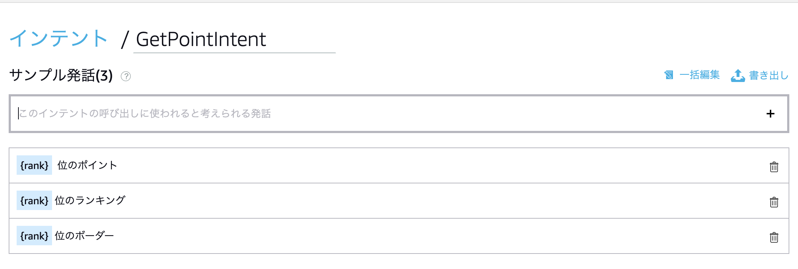
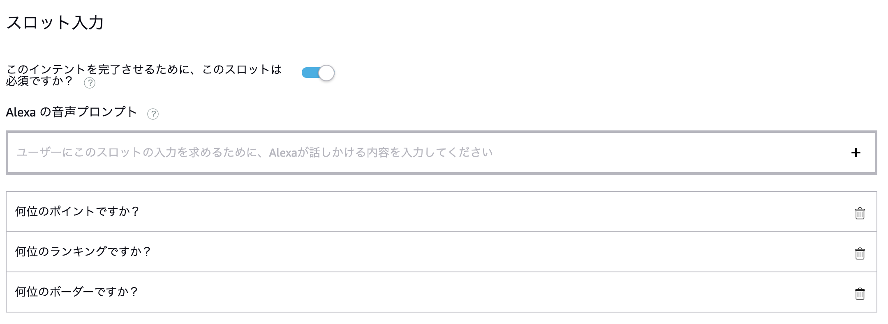
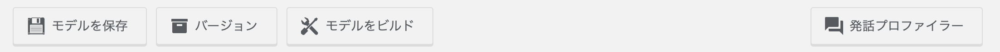
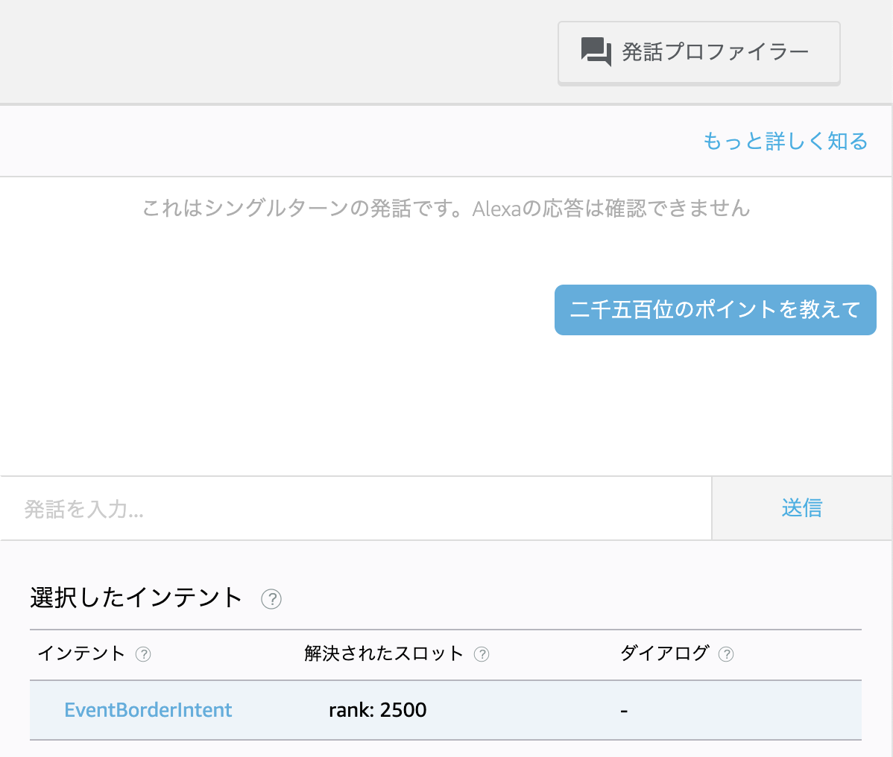
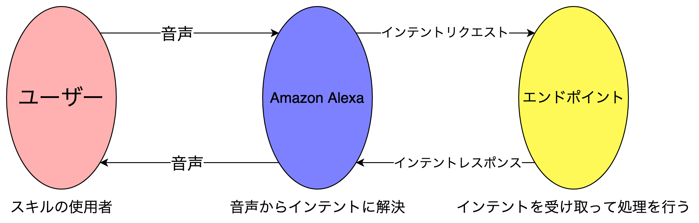
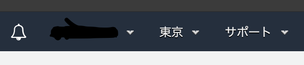
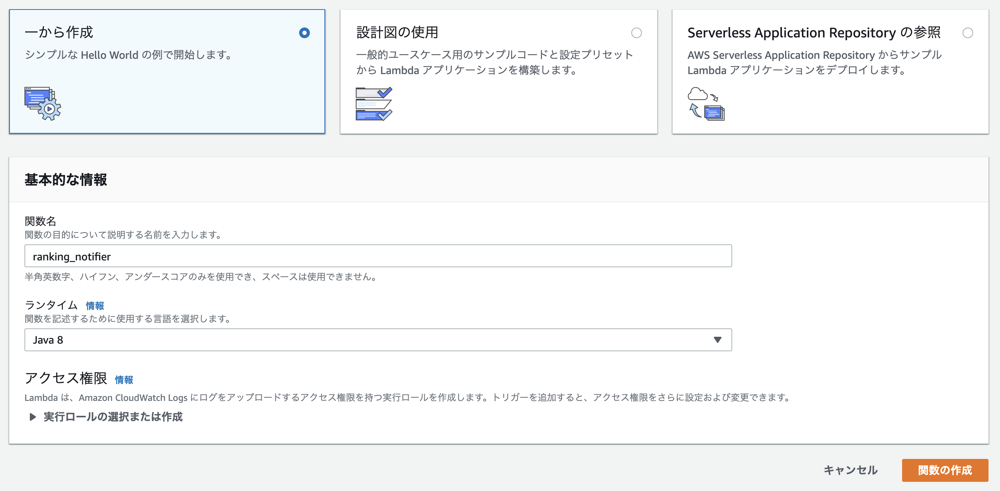
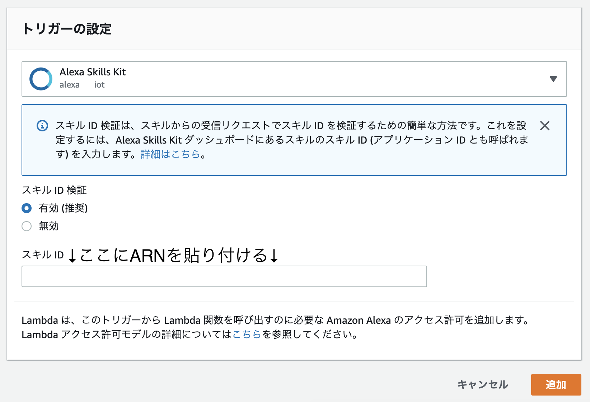
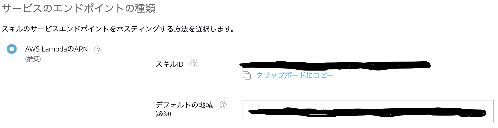

# 青羽美咲が業務効率化を目指してAlexaスキルを作る話

## プロローグ

「せーのっ！」  
「「「2周年と誕生日、おめでとう！！！」」」  

今日は6月29日、それはこの765プロライブ劇場のオープン記念日であり、ここで事務などを担当している私、青羽美咲の誕生日です！
今はそのお祝いということで、劇場のみんながパーティを開いてくれました。
こんなに大勢のアイドルのみんなに祝ってもらえるなんて、感激すぎてちょっと涙が…

「青羽さん、誕生日おめでとうございます」  
この劇場とアイドルがトップを目指す39プロジェクトのプロデューサーさん。  
一人で52人のアイドル全員を担当している、すごい人です。  
「わっ！プロデューサーさん！ありがとうございます！」  
「いやぁ、この劇場も3年目に突入ですね。次の一年ももっと飛躍できる年にしたいです」  
普段は成人組の人たちといるときしかお酒は飲まないみたいなんですけど、流石に今日はプロデューサーさんもお酒を飲んでますね。  

「青羽さんも誕生日なわけですが、次の一年でなにか目標とかあったりしますか？」  
「目標ですか…。これだ！というのは決めてないんですけど、せっかくなのでなにか新しいことに挑戦したいですね」  
「すごく良いと思います」  
そういえば社長が『次の一年は、765プロのさらなる飛躍の一年だ！』って言ってたっけなぁ。  

新しいこと。  
この劇場で事務員としていろいろとお仕事をしてきて、少しでもアイドルのみんなが輝くお手伝いをできたら良いなと思って頑張ってきたけど、何か新しい方向からアイドルのみんなやプロデューサーさんをお手伝いできたら…

## 第1話「あれくさ…？」  

「うわー！律子！想定より順位が落ちてる！」  
「え、何位まで落ちたんですか？」  
「250位…」  
「え、そこまで落ちたんですか？もー、しっかりしてくださいよプロデューサー！」  
「すまん！」  
「謝ってないで走ってください！ほら！早く！」  
楽しかったオープン記念パーティと私の誕生日から2日後、プロデューサーさんは周年イベントを黙々と走ってます。
今回は周年イベントということで、上位100位以内入賞で虹称号がもらえてエンドロールに名前が載るらしいです。
私には何の話なのかよくわからないけど、きっと大事なお仕事なんだと思います。
傍から見てると携帯でゲームして遊んでるようにしか見えないんですが…

「それにしても、さすが周年イベント…。6時間のリフレッシュタイムとプロデューサーの寝坊のせいとはいえ、ここまで順位が落ちるなんて…」  
「律子さん、わざわざ手伝っていただいてありがとうございます」  
「あー、いえ！プロデューサーは来週いっぱいまで動けませんし、仕方ないですよ」  
秋月律子さん、この765プロのアイドル。
だけど、忙しいときはたまに事務なんかの手伝いをしてもらってます。  
「まぁ、プロデューサー殿にはその分きっちりと良い順位を取ってもらいますけどね！」  
律子さんにそう言われて、プロデューサーさんがビクッと少し震えたように見えます。
プロデューサーさん、頑張ってくださいね。

「一回360消費で1000ptだから、ブーストすると…いや、来週から2倍で…」  
プロデューサーさんがブツブツと何かいいながら携帯と向き合っている中、私と律子さんは仕事を片付けていきます。
お仕事をこなしながら、つい先日にオープンから2周年を迎えた劇場の話に。  
「それにしても、プロデューサーさんっていつもこんな量の仕事をこなしてるんですね…」  
「まあ、私を含めて52人のアイドルを一人で見てるわけですからねー」  
プロデューサーさん、一人であれだけの仕事をこなしてるなんて、改めて考えると本当にすごいよなぁ。

「そうそう、青羽さんにプレゼントがあったんでした」  
そう言って、律子さんはカバンの中から四角い箱を取り出しました。  
「本当はパーティの時にお渡ししたかったんですけど、届くのが遅れちゃいまして…」  
「いえいえそんな！ありがとうございます！なんですか？」  
「今開けて大丈夫ですよ。というか、ここで設定したほうが良いと思いますし」  
「設定…?」  
「これはAmazon Echoって言って、いわゆるスマートスピーカーってやつですね。Alexaって聞いたことないですか？」  

## 第2話「すきる…?」  

「『Alexa できること』で検索っと…」  
律子さんに初期設定をやってもらい、セットアップを待っている間にちょっと検索してみる。  
「へー、いろんな事ができるんですねー…」  
「スキルを追加すれば何でもできますよ。」  
「スキル…?」  
「えっと…スマートフォンで言うアプリみたいなものですね。無料でいろいろ公開されてるんですよ。」  
「へー、いろんなのがあるんですねー。」  
携帯のAlexaアプリから、各種設定やスキルの検索、追加ができるみたい。  
「スマートフォンよりできることは少ないですけど、声で操作するので作業しながらでも使えて便利なんですよ。」  
「へー、律子さんはどんなスキルを使ってるんですか？」  
「私は標準で入っているリマインダー機能や音楽再生機能をよく使ってますね。」  

さて、ここで筆者おすすめのスキルを紹介します

- 【非公式】ミリオンクイズ
    - ウェイクワード `アレクサ、ミリオンクイズを起動して`
    - ミリオンのキャラ名から中の人を当てるクイズ
        - 5問出題されるので、それに答えるだけ
        - 一部キャラクターの発音がおかしかったり、中の人の名前をちゃんと聞き取ってくれなかったり…
        - シンプルですが、隙間の時間にサッとできるので筆者もたまに遊んでます
- 上田麗奈の時報
    - ウェイクワード `アレクサ、上田麗奈の時報を開いて`
    - 高坂海美の中の人、上田麗奈さんが現在の時刻を読み上げてくれるスキル
        - 読み上げてくれるだけじゃなく、その後にランダムでちょっとしたセリフがついてきます
        - 夜遅い時間だと「早く寝ないと」と言ってくれたりと、時間によってもメッセージが変化するみたいです
        - 筆者は寝る前や朝起きたときに聞いて、癒やされたり活力をもらったりしてます
- radiko.jp
    - ウェイクワード `アレクサ、ラジコを開いて`
    - スマートフォンからラジオが聞けるサービス、radikoのAlexa版
        - 作業中にラジオを聞くときに、声で操作できるのでとても使いやすいスキルです
        - 声優さんのラジオもあったりするので、よく聞いてます

## 第3話「かすたむすきる…?」  

「よし！次の公演の衣装ができた！次は…」  
*「♪〜 音無先輩に先月の収支確認のリマインダーです」*  
「あ、もうそんな時間…。」  
律子さんにEchoをいただいてから数日、いろんな機能やスキルを調べながら使ってます。

最初の頃は何に使おうか悩んでたけど、律子さんに教えてもらって最近はリマインダー機能と音楽の再生機能をよく使っています。
携帯のリマインダーの機能もいいんだけど、Alexaだと声で操作できるから便利！  
「さてと、音無先輩は…っと」  

「あ！青羽さんもAlexa使ってるんですか？」  
音無先輩に確認のメールを送って、ちょっと休憩していたら松田亜利沙ちゃんが事務室に来ました。  
この劇場のアイドルなんですが、本人自身もアイドルが大好きみたいでよく写真を取ってたりします。  
「そうなんですよ、律子さんから頂いて…。亜利沙ちゃんも持ってるんですか？」  
「亜利沙は今、アイドルちゃんに関するスキルを作ってるんですよ！ムフー！」  
「え！？スキルって作れるんですか！？」  
あ、でも確かに、誰か作る人がいないとこんなにたくさんのスキルは使えないか。  
「カスタムスキルって言うんですけど、自分で好きなスキルを作ったりできますよ」  
「へー…でも、難しそう…」  
「確かに難しいですけど、でも案外なんとかなりますよ。
亜利沙もプログラミングはほとんど出来ないので音無さんに手伝ってもらってるんですけどね。」  
「音無先輩、プログラミングなんてできるんだ…」  
「新しいことに挑戦するのは楽しいですからね！  
それがアイドルちゃんに関係することなら、なおさらです！」  
音無先輩、前は本を作ったことがあるって言ってたし、いろんなことができるんだ…  
すごいなぁ、また聞いてみよう。

「ふぅ…今日もお仕事頑張った！」  
20時過ぎ、そろそろ帰ろうかな。  
「スキルって作れるんだ…」  
ふと、昼間の亜利沙ちゃんとの会話を思い出しました。  
「カスタムスキル、難しそうだけど…」  
新しいこと。  
先日のオープン記念パーティでプロデューサーさんとの会話を思い出します。  
『目標ですか…。これだ！というのは決めてないんですけど、せっかくなのでなにか新しいことに挑戦したいですね』  
『すごく良いと思います』  
「そういえば、プロデューサーさんは仮眠室だったかな…」  
仮眠室を覗くと、プロデューサーさんは相変わらず携帯に向かってブツブツと何かを言っています。  
「私は私になる…おそろいのフレーズ…今日のステップ…高みを目指して…」  
「…お仕事頑張ってるみたいだしそっとしておこうっと」  
そういえば、プロデューサーさんと律子さんが順位とか言ってたっけ…。  
「今の順位を教えてくれるカスタムスキルとかあったら、プロデューサーさん喜んでくれるかな…。」  
できるかは分からないし、そもそもどうやるのかすら全くわからないけど。  
でも…  

「よし！」  

筆者です。  
美咲さんは現在のイベント順位を教えてくれるカスタムスキルを作るようです。  

Alexaのカスタムスキルを作るには、Amazonの開発者アカウント(≠AWSアカウント)が必要です。
**登録の際は自分のAmazonアカウントと同じ国のページから同じメールアドレスで登録してください。**
Amazonの日本(.co.jp)のアカウントを持ってるのなら、JPのサイトから開発者アカウントを登録してください。
スキルのテストの際に、開発者アカウントが紐付けられているデバイスから開発中のスキルを試すことが出来ます。
その際、別の国のページからだと別のアカウントとなるためテストすることが出来ません。
登録するサイトのURL/言語/国には気をつけてください。

どうやって登録するのかは、今後変わったりしますし今回の本題からは外れるので、ここでは扱いません。
Amazonのヘルプページを見てもらったほうが良いと思います。

## 第4話「いんてんと…?」  

「えっと…『Alexa カスタムスキル チュートリアル』っと…」  
亜利沙ちゃんにアカウントの登録を手伝ってもらって、公式のチュートリアルページがあるのを教えてもらいました。  
なんでも『いろんな人が解説記事を書いてるんですが、公式のが一番わかりやいですよ！』だそうです。  
「ふむふむ、なるほど。まずはどういう受け答えをするかを決めると…」  

今回作るのは今のイベントの順位を教えてくれるスキルだから…

> アレクサ、今の順位を教えて

に対して

> 今の順位は○○位です

って返って来るような感じかな。

あー、後は

> 今の100位のポイントを教えて

に対して

> 今の100位の人のポイントは○○○ptです

って返ってくる機能もあったら便利かな

「うん、こんな感じかな」  
とりあえず、スキルの基本的な機能はこれで良さそう。  
「で、<u>ユーザーがスキルを使って実行できるアクション</u>のことを**インテント**という…」  

この場合、

- 今の順位を教えてくれるインテント
- 今のn位のポイントを教えてくれるインテント

の2つかな  
「インテントに、**インテント名**、**サンプル発話**、**スロット**を設定する…。うーん、難しい…」  

インテント名はそのまま、インテントの名前。
『今の順位を教えてくれるインテント』なら、`GetRankingIntent`とかかな。

で、サンプル発話はそれぞれのインテントに前もって決めておく起動コマンドみたいなもの…？  
`GetRankingIntent`なら、

- 今の順位を教えて
- 順位を教えて
- 今は何位？

あたりかな。

『今のn位のポイントを教えてくれるインテント』なら、それぞれ

- インテント名
    - `GetPointIntent`
- サンプル発話
    - 今の○○位のポイントを教えて
    - ○○位は何ポイント？

とかかな。

で、スロットはインテントに必要な引数となるデータ…どういうことだろう？  
今回の場合だと、`GetPointIntent`は何位のポイントを取るのか指定しないと行けないから、順位を指定するスロットを`GetPointIntent`を設定しないといけないのかな。

`GetRankingIntent`は必要な引数はないから、こっちは設定なしっと。

`GetPointIntent`のスロットの名前は`rank`スロットにしよう！

あと、スロットにはタイプを指定する必要があるって書いてある。  
例えば、地名や人物名、日時などなど…。
あ、自分でカスタムスロットを作るのもできるんだ。  
`GetPointIntent`の`rankスロット`は何位かっていう情報だから、数値(AMAZON.NUMBER)タイプかな。

あ、`rankスロット`は`GetPointIntent`を実行するのに絶対に必要な情報だから、『このインテントを完了させるために、このスロットは必須ですか？』にチェックを入れてっと…

「うん、良さそう！」  
忘れないようにちゃんと保存して、モデルをビルドして、さっそく発話プロファイラーで確認！

「『2500位のポイントを教えて』っと…あ！ちゃんと認識されてる！やったー！」  

## 第5話「ことりん…?」  

「亜利沙ちゃんから聞いたわよ？美咲ちゃんもAlexaのスキルを作ってるって」  
「あれ？音無先輩！お疲れ様です！」  
普段は事務所にいる音無先輩が劇場に来るなんて珍しい…。  
「いやー、美咲ちゃんがAlexaのカスタムスキルを作ってるって聞いて、ちょうど用事もあったしこっちに来ちゃったの」  
「なるほど…。あ、とりあえずお茶出しますね」  
「あ、私も手伝うわ」  

音無先輩が劇場に来て、キリがいいのでちょっと休憩中です。  
それに、ちょうどお願いしたいこともありましたし…  
「それで、もし大丈夫なら音無先輩にプログラムを書いてほしいんです…」  
「イベントを走っているプロデューサーさんのためにカスタムスキルを作る…美咲ちゃん、なんていい子なの…」  
「お、音無先輩？」  
「わかったわ美咲ちゃん！私、できる限り協力するわね！」  
「ありがとうございます！」  

えっと、私はカスタムスキルのエンドポイントを作ればいいのね。

カスタムスキルに関しては、プログラミングと言っても音声処理や細かい処理はAlexa側でやってくれるから、そこまで難しくないの。  
しかもAmazonがライブラリを配布しているから、それを使えば更にお手軽にプログラムを書けるのよ。

スキルのインテントの設計をしたと思うけど、スキルの使用者が話した内容をAlexa側がインテントに当てはめてくれるの。  
だから、あと必要なのはそれを受け取って実際に処理をするエンドポイントね。

さっき『Amazonがライブラリを配布している』って言ったと思うけど、今の所(2019年8月現在)、

- NodeJS
- Python
- Java

の3つの言語でライブラリが公開されているの。  
それぞれの言語でのライブラリの導入方法や使い方はここでは置いておくとして、今回はKotlinで書いていくからJavaのライブラリを使うわね！

どの言語のライブラリも基本的な概念は一緒で、Alexaからインテントリクエストを受け取って処理をしてインテントレスポンスを返す**インテントリクエストハンドラー**を定義していくの。  
インテントリクエストハンドラーは、Model-Controller-Viewで言うところのC、コントローラに当たるわね。

もし美咲ちゃんもプログラミングに興味が出てきたら、Amazonが公開している公式ドキュメントか、ライブラリのドキュメントを見るといいわよ。

「な、なるほど…全然分からないですけど、音無先輩ってこんな事もできたんですねー」  
「うふふっ、まぁ昔にちょっとね…」  

やっぱり、音無先輩はすごいです！

## 第6話「らむだ…?」  

*「ピコン」*  
「あ、音無先輩からだ」  
*「前に頼まれてたAlexaのスキルのエンドポイントのプログラム、できたわよ！」*  
「わー、もうできたんだ」  
送られてきたURLから、ファイルをダウンロード。  
「えっと…C96原稿_最新版.pdf…あれ？PDF？」  
*「ピコン(メッセージが削除されました)」*  
「あれ、消えた」  
*「前に頼まれてたAlexaのスキルのエンドポイントのプログラム、できたわよ！」*  
「また同じメッセージだ」  
ranking_notifier.zip、これかな？  
PDFの方はよくわからないけど、また音無先輩にお礼しないと！  

「さてと、後は音無先輩に作ってもらったプログラムをアップロードするだけ…」  
公式ドキュメントに書いてあった、AWS Lambdaっていうのに置けばいいんだっけ。

筆者です  
Alexaのカスタムスキルの作成に必要なエンドポイントですが、公式ではAWS Lambdaが推奨されています。  

一応、自前のサーバーを用意して、そこで動かすことも可能ですが、

- TLS化必須
- Alexaから飛んできたリクエストの検証が必須
- そもそもサーバの管理が面倒

という点から、美咲さんはAWSを使うようです。

Lambdaの場合、Alexaスキルに割り振られたARN(AWS上で一意なリソースに割り当てられるID)が発行されるので、それをLambdaのトリガーに指定してあげればすぐに動きます。  
金銭的な面でも、Lambdaは(2019年8月現在で)100万req/monthまで無料で使えるので、よほどのことがない限りは大丈夫と思います。

また、これはAlexaのカスタムスキルに限らないことですが、AWSの操作をする際は右上の選択されている地域に注意してください。
日本国内なら基本的に東京で大丈夫だと思いますが、これを間違えると地球の裏側でインスタンスが建てられたりしてしまいます。

えーっと、前に音無先輩に設定してもらったAWSのアカウントにログインして…  
右上に『東京』って表示されているのを確認して、Lambdaを選択して『関数の作成』っと

名前を入力して、『ランタイム』にJava8を選択して、関数の作成

よし、あとはカスタムスキルのARNをLambdaのトリガーに選択して…

LambdaのARNもカスタムスキル側に入力して…

zipファイルをアップロード！

「よ、よーし！おっほん！」  
緊張の瞬間です…  
「Alexa、ランキング情報で今の順位を教えて」  
*「…現在のプロデューサーさんの順位は、13位です」*  
「おー！やったー！！！」

## エピローグ

「プロデューサーさん！今少しお時間大丈夫ですか？」  
「はい、少しだけなら…なんですか？」  
「えっとですね…」  

新しいことに挑戦するのは不安だったけれど…

「…こうやって、今の順位やポイントを確認できるスキルを作ったんですよ！」  
「おー、すごい！」  

それでも、いろんな人に教えてもらって、自分でもいろいろ調べて…

決して簡単ではなかったですけど、

「いやー、ブースト中とかは順位を確認する暇すら惜しいので、すごい助かります！ありがとうございます！」  

でも、新しいことに挑戦してよかったと思います！

「お役に立てて嬉しいです！」

プロデューサーさん！お仕事頑張ってくださいね！
