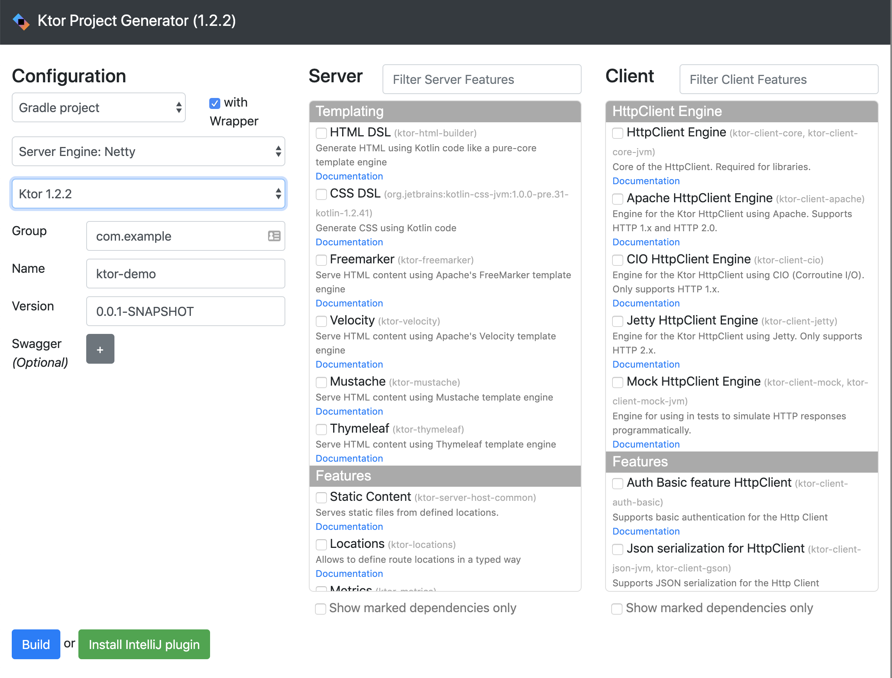
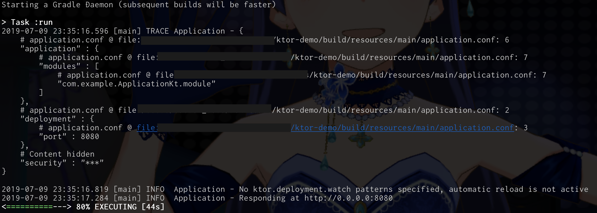
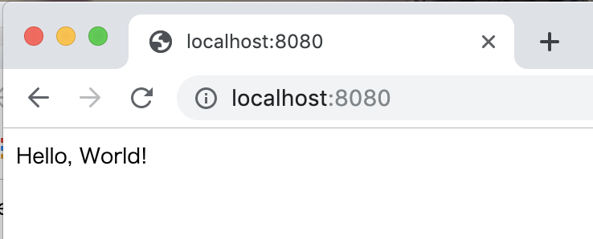
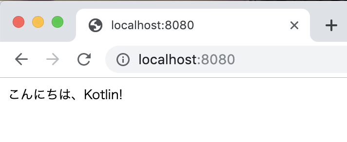
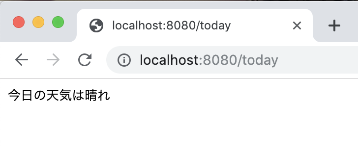

# 小鳥さんと一緒に100%Kotlinでサイト製作<br><span class="subtitle">〜Backend編〜</span>
<p class="right">著:にしこりさぶろ〜</p>

_前回のあらすじ！_(\*1)

　新しいコーポレートサイトを発注した765プロダクション。発注先はとある売れっ子俳優のHPも手がけたデザイナーともあり、期待に胸膨らませる高木社長と事務員・音無小鳥。しかし入稿日、送られてきたサイトは軽さと速度、そしてコンプライアンス(=Javascript使ってない的な意味で)のためにその他全てを犠牲にした、日本人的侘び寂びを体現するかのごとく質素で簡素な何かだった！


<center>図1. 765プロ新コーポレートサイト</center><br/>

　「このままではいけない！」　立ち上がったのは、つい先日転職してきたばかりの新人Pだった！　小鳥から告げられたデッドラインは3日後。即席デスマーチも、アイドル達の笑顔のためならなんのその！　前職のエンジニアの経験をフルに活かし、人生何度目か分からない3徹を乗り越え、新人Pはどうにか765プロの危機を救ったのである。

　事務所の机に突っ伏す新人P。起こさないようにと、小声でPをねぎらう小鳥の目に入ったのはディスプレイに映る「Kotlin」の文字。そう、このP、華麗なジョブチェンジの後もなお、Kotlinを愛し、その発展に貢献せんとする1人の技術者だったのだ。

<footer>\*1 前回: https://youtu.be/8oB-JudUejE?t=6360 (IM@S Engineer Talks 2019)</footer>

　「Kotlinを愛するプロデューサー、これは最早、事務所の同僚を超えた、赤い糸で結ばれた関係…！」　そう悟った小鳥は、目を覚ましたPにありったけの熱意を携え、こう告げるのだった。

<center><strong>「私に、Kotlinを教えてください！」</strong></center><br/>

## Kotlinとは...

#### 小鳥
さて、Pさん。早速なんですが…。

#### P
はい、音無さん。どうしました？

#### 小鳥
…Kotlinって何か教えていただけますか…？　そもそもプログラミングが何かも、全く分からなくて…。

#### P
…まぁ、そうですよね。良いですよ、1からしっかり教えますから！

Kotlinは、チェコに本社を置くJetBrains社が開発している、静的型付けのオブジェクト指向プログラミング言語なんです。JVM上で動作をして、Javaよりも簡潔かつ安全にコーディングができるよう、文法が設計されています。実際の開発現場における実用性に、かなりの主眼を置いているのが大きな特長ですね。その証拠と言ってはなんですが、型推論が非常に優秀だったり、Null安全やシングルトンが言語レベルでサポートされていたり…。

#### 小鳥
じ、じぇーぶい…、かたすいろん…、ちょっとあの、Pさん…？　置いていかないでください…。

#### P
あっ、すいませんつい…。

そうですね。僕があれこれ講義するより、とりあえず動くものを作った方がいいかも知れないですね！　まずはサーバーサイドKotlinで、「Hello, World!」を作ってみましょう！


## KtorでHello, World!

#### 小鳥
え？　そんないきなり、私に作れますか…？　Excel方眼紙との闘いなら負けませんけど…。

#### P
ブラウザとエディタがあれば問題なしですよ。それに、765プロのPC、ブラウザもエディタも全部、僕が入社初日にChromeとVSCodeに置き換えておきましたから！

じゃあまずは、「Ktor Project Generator」にアクセスしましょう。

#### 小鳥
えーっと、このサイト、ですか？　なんだかチェックボックスがたくさんありますね…。


<center>図2. Ktor Project Generator(https://start.ktor.io)</center><br/>

#### P
そうですそうです！　ひとまずチェックボックスは無視して、左下の青い「Build」ボタンを押してください。

#### 小鳥
あ、zipファイルがダウンロードされましたね！　これを…？

#### P
適当なところで解凍しちゃってください。中に「Application.kt」って名前のファイルがあると思うんですけど…。解凍したフォルダの「src」フォルダの中に…。

#### 小鳥
ありました！　善は急げ、開いちゃいますね！

```kotlin:Application.kt
package com.example

import io.ktor.application.*
import io.ktor.response.*
import io.ktor.request.*

fun main(args: Array<String>): Unit = io.ktor.server.netty.EngineMain.main(args)

@Suppress("unused") // Referenced in application.conf
@kotlin.jvm.JvmOverloads
fun Application.module(testing: Boolean = false) {
}
```
<center>コード1. Application.kt(解凍したて)</center><br/>

#### 小鳥
ぴ、ぴよ…、何も、わからないです…。

#### P
まぁまぁ、最初はみんなそんなもんですよ。まずは動くもの、ですよ！

えーっと、それじゃあこのファイルの中括弧の中にプログラムを書いて欲しいんですけど、僕の教える通りに書いてもらってもいいですか？

#### 小鳥
は、はい！　お願いします！

```kotlin:Application.kt
package com.example

import io.ktor.application.*
import io.ktor.response.*
import io.ktor.request.*
import io.ktor.http.*
import io.ktor.routing.*

fun main(args: Array<String>): Unit = io.ktor.server.netty.EngineMain.main(args)

@Suppress("unused") // Referenced in application.conf
@kotlin.jvm.JvmOverloads
fun Application.module(testing: Boolean = false) {
    routing {
        get("/") {
            call.respondText("Hello, World!", ContentType.Text.Plain)
        }
    }
}
```
<center>コード2. Application.kt(Hello, World!を返すように)</center><br/>

#### 小鳥
こんな感じ、ですか？

#### P
はい、良いと思います！　ここまで来たら最後に、こっちの黒い画面でこのコマンドを実行してもらえます？

#### 小鳥
えーっと、こう、ですか？

```
$ ./gradlew run
```


<center>図3. サーバー立ち上げコマンド実行後</center><br/>

#### 小鳥
何か、動いてますね…。よくわからないけど、ハッカー？になった気持ち…。

#### P
よし、ひとまずこれで完成！　です！

#### 小鳥
え？　もう完成ですか？

#### P
試しに、ブラウザで「localhost:8080」って直接打ち込んで、アクセスしてみてください！


<center>図4 Hello, World!</center><br/>

#### 小鳥
え！　す、すごいです！　「Hello, World!」って表示されてます！

#### P
どうですか！？　簡単ですよね！？　じゃあ試しに、「Hello, World!」を「こんにちは、Kotlin!」に書き換えてみてください。


<center>図5. こんにちは、Kotlin!</center><br/>

#### 小鳥
さっきと表示される文字が変わりました！

#### P
よし、じゃあ次は、さっきのプログラムにもう少し追記してみましょう。こんな感じで。

```kotlin:Application.kt
    routing {
        get("/") {
            call.respondText("Hello, World!", ContentType.Text.Plain)
        }
        get("/today") {
            call.respondText("今日の天気は晴れ", ContentType.Text.Plain)
        }
    }
```

<center>コード3. Application.kt(ルーティング追加)</center><br/>

#### 小鳥
できました！

#### P
OKです！　それじゃ、今度は「localhost:8080/today」にアクセスしてみてください。


<center>図6. 今日の天気は晴れ</center><br/>

#### 小鳥
また表示が変わりました！　あれ…？　でも「localhost:8080」に戻ると、さっきの「こんにちは、Kotlin!」が表示される…！　何だか、Webサイトっぽいですね！

#### P
ですよね！　さて、今日は最初ですし、このくらいで終わりにしようと思いますが。どうです？

#### 小鳥
すごく楽しいです！　まだ短い文字を出すだけですけど、これから色んなことが
できそうな気がして、わくわくしちゃいます！

#### P
そう思ってくれたら嬉しいです！　次回以降、僕もどうやったら楽しみながらKotlin勉強できるか、色々考えてみますね。

#### 小鳥
よろしくお願いします！　今日はありがとうございました。

## Hello, World!

## リクエストを送る

## JSONを返す

## HTMLを返す

## パラメーターの型チェック
