# プレイリストを自動生成
<p class="right">著:Wakuwaku</p>

## はじめに

### 対象者

- アイマスの曲が多すぎて困っている方
- Synology社のNASを購入する予定・持っている方

### このChapterを読むにあたっての注意点
- Synology社のNASを持っている必要があります

## 問題

現在僕が管理している音楽トラックはアイドルマスターのみで(ラジオCD・ドラマCD・カバー・BGMを含み)6000を超えている。
これほどたくさんあったら聴く曲の偏りが発生するだろう。

僕の場合音楽を聴くときよくあるパターンとして以下の4つある。

- 新しくリリースされたCD
- いつものプレイリスト
- 10th LIVE プレイリスト
- Re:ステージ!全曲シャッフル

これでは多くても100曲程度になってしまう。

NASでどこでもライブラリ内の曲すべてを聴くことができる環境を構築したというのにもったいない。

## 解決方法

何かしらの規則でプレイリストを作成すれば，1年間でより多くの曲を聴けるのではないか。

アイドルの誕生日を使えば祝いながら楽しくアイマスの世界に浸れるかもしれない。

## 実装

### 0. 今回使うもの

- im@sparql
- Synology DS918+
  - Audio Station
  - Docker
  - Node-RED

### 1. NASにDockerをインストール

#### 1-1. パッケージセンターで`Docker`で検索

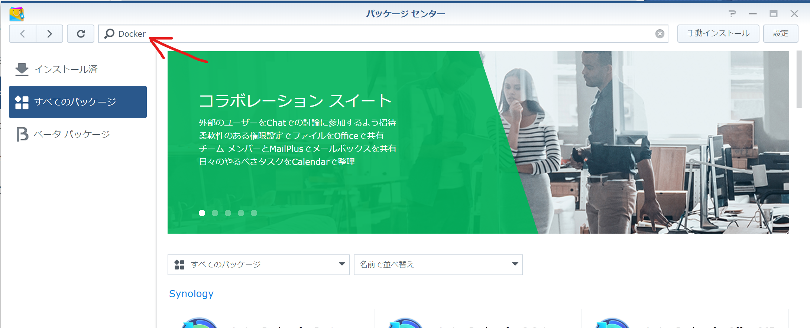

#### 1-2. Docker をインストール


`インストール`をクリックしたら自分の環境に合わせてインストール先の設定を求められる場合がある。

### 2. Node-REDの準備

#### 2-1. Docker Image 「nodered/node-red-docker」のダウンロード

レジストリを開いて`node-red`で検索。nodered/node-red-dockerをダウンロード。

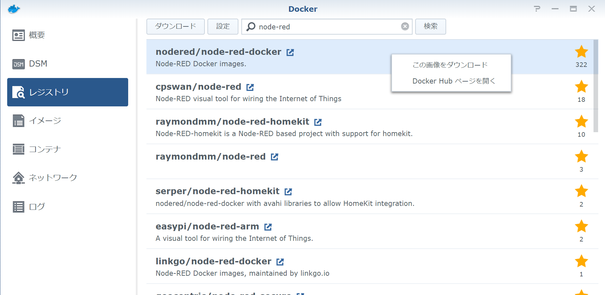

#### 2-2. Docker Container を立ち上げる

イメージを開いて`nodered/node-red-docker:latest`をクリック。起動ボタンを押す。ウィンドウが開くので詳細設定を押す。

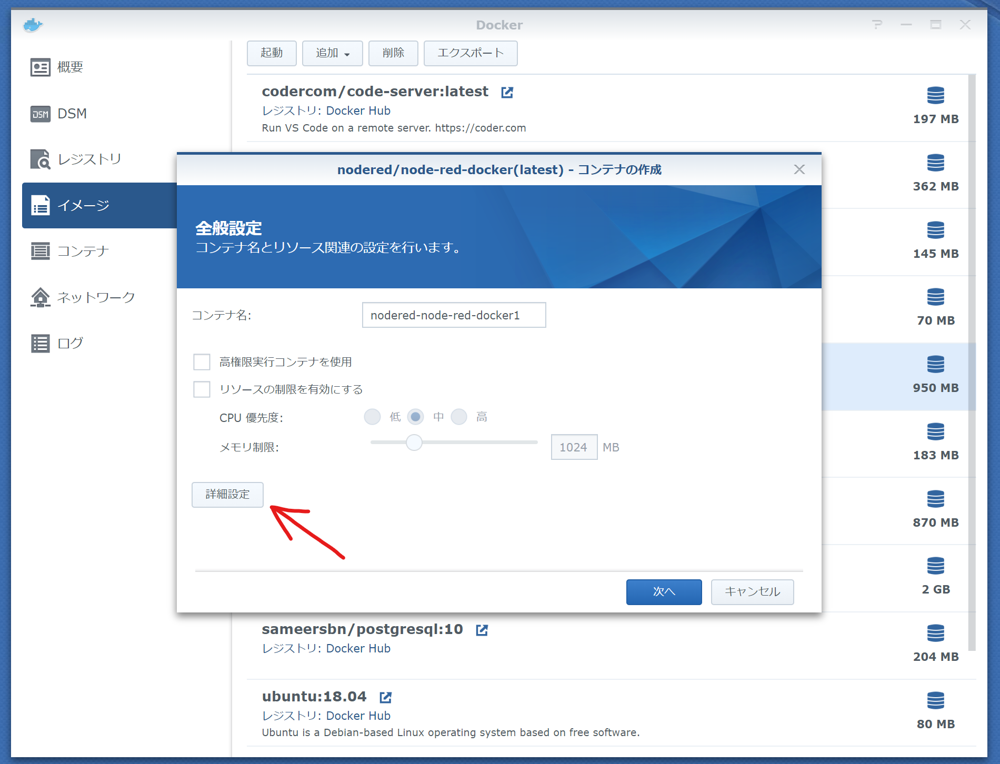

コンテナと通信するためのポート設定をする。ここではNode-REDと同じ`1880`に設定する。
設定したポート番号でNode-REDにアクセスできる。
設定したら`適用`をクリックし，詳細設定ウィンドウを閉じる。

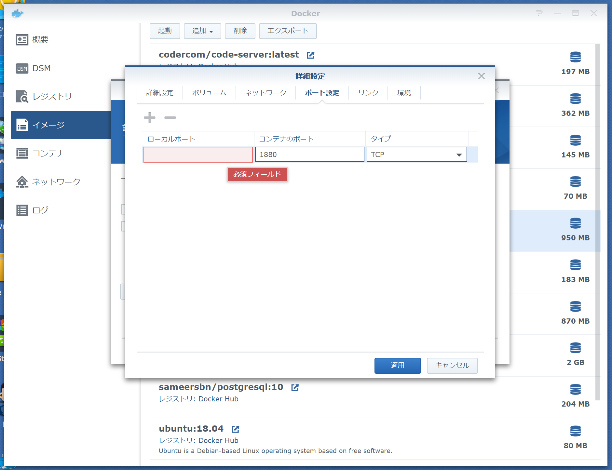

コンテナ作成ウィンドウに戻り，`次へ`をクリックする。
ポート設定が正しくできているかチェックする。
適用をクリックして，コンテナを起動する。

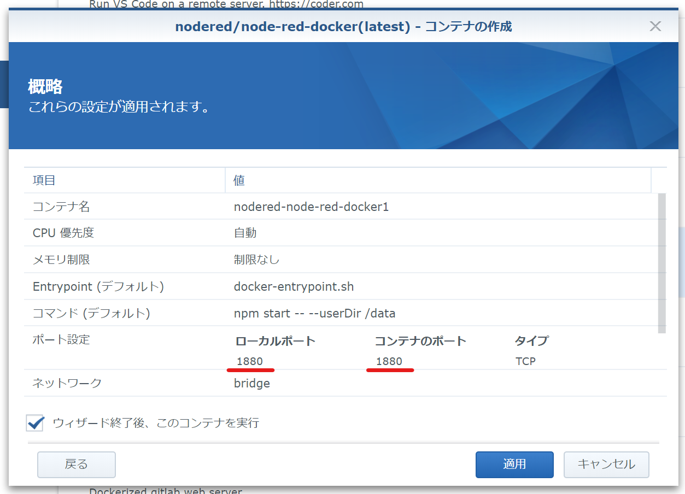

コンテナを開き，node-redのコンテナが立ち上がっているか確認する。

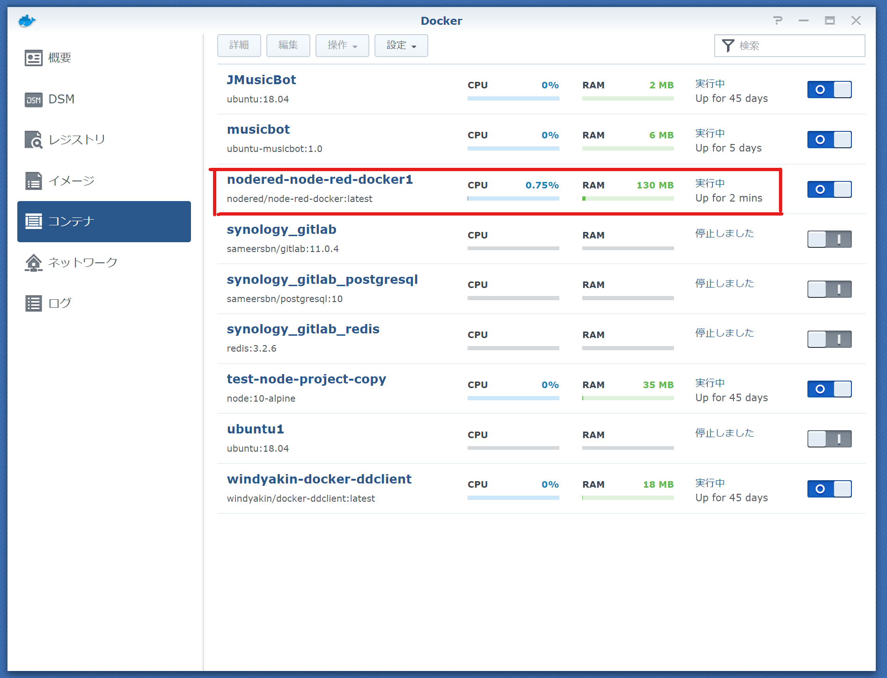

#### 2-3. Node-RED接続確認

`http://{NAS_IP}:1880`にアクセスする。

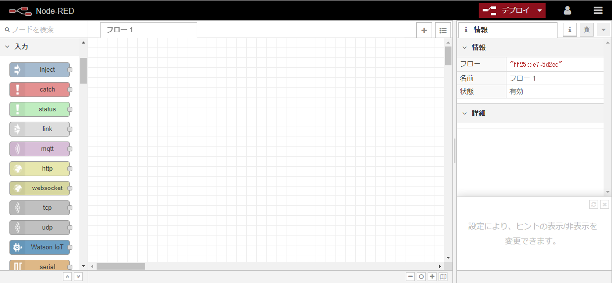

#### 2-4. ノードの追加

右上メニューから`パレットの管理`->`ノードの追加`を開く。`syno`で検索する。`node-red-contrib-syno`を追加する。

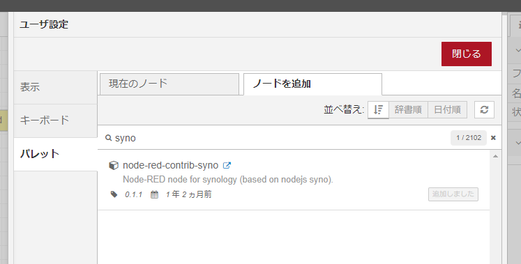

以下のノードが追加される。

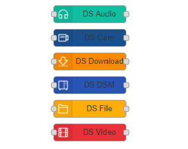


### 3. フロー作成

#### 3-1. 定期実行設定

入力の`inject`を使う。ペイロード`日時`，繰り返し`指定した日時`にする。

#### 3-2. 誕生日のアイドルを取得する

im@sparqlからデータを取得する。機能の`function`でクエリパラメータの文字列を作成する。

```js
const date = new Date(msg.payload);
// 日付フォーマット
const dateFormat = {
  _fmt : {
    "yyyy": function(date) { return date.getFullYear() + ''; },
    "MM": function(date) { return ('0' + (date.getMonth() + 1)).slice(-2); },
    "dd": function(date) { return ('0' + date.getDate()).slice(-2); },
    "hh": function(date) { return ('0' + date.getHours()).slice(-2); },
    "mm": function(date) { return ('0' + date.getMinutes()).slice(-2); },
    "ss": function(date) { return ('0' + date.getSeconds()).slice(-2); }
  },
  _priority : ["yyyy", "MM", "dd", "hh", "mm", "ss"],
  format: function(date, format){
    return this._priority
      .reduce((res, fmt) => res.replace(fmt, this._fmt[fmt](date)), format);
  }
};
const now = dateFormat.format(date, 'MM-dd');
// クエリ作成
const query = `
      PREFIX schema: <http://schema.org/>
      PREFIX rdfs:  <http://www.w3.org/2000/01/rdf-schema#>
      SELECT ?name
      WHERE {
        ?uri schema:birthDate
        ?date;rdfs:label
        ?name;
        FILTER(contains(str(?date), "${now}" )).
      }order by(?name)
    `;
// ヘッダー設定
msg.headers = {
    Accept: 'application/sparql-results+json',
};
msg.query = encodeURIComponent(query);
return msg;
```

`msg.headers.Accept`の設定をしないとXML形式でデータが返ってくるので処理が大変になる。

機能の`http request`でim@sparqlのエンドポイントを叩く。メソッド`GET`，URL`https://sparql.crssnky.xyz/spql/imas/query?query={{query}}`にする。

`function`でim@sparqlから取得したデータから使うデータを抜き出し，整形する。

```js
msg.payload = msg.payload.results.bindings
              .map(data => data.name.value) || Array();

return msg;
```
`change`を使ってアイドルの名前リストをmsg.payload以外に設定する。

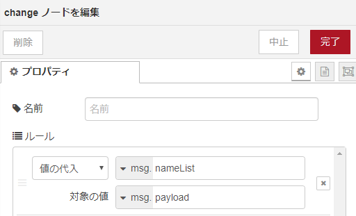

#### 3-3. NASに保存してある曲の情報を取得する

アーティスト，アルバム，曲の順にデータを検索する。

誕生日のアイドル名が入っているアーティストを取得する。

誕生日のアイドルの人数分ループする。

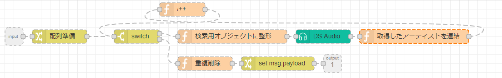

同じように，アーティストを使ってアルバムの取得，アルバムを使って曲情報を取得する。

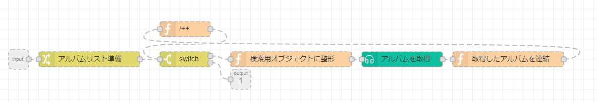
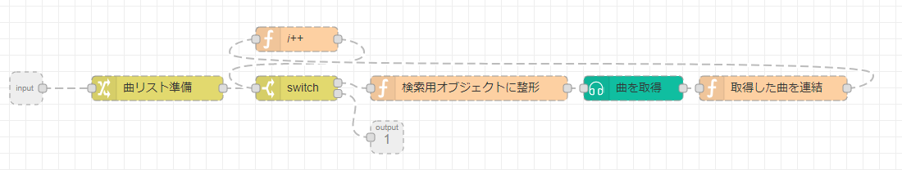

#### 3-4. NASにプレイリストを登録する

`3-3`で取得した曲情報からIDのリストを作成する。  `msg.payload`にリクエストパラメータを設定する。

```js
msg.payload = {
  name: '今日のプレイリスト',
  songs: msg.songs,
};
return msg;
```

`DS Audio`ノードでAPIを叩く。Topicを`createPlaylist`に設定する。

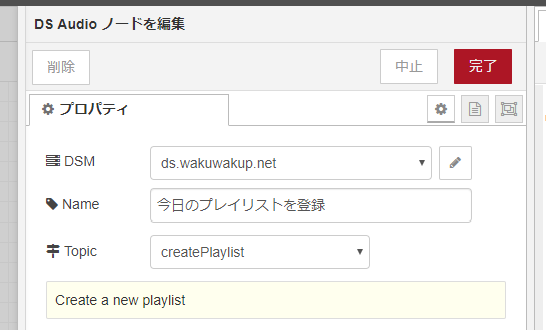

ここまででプレイリストの作成ができるはずだ。

jsonを読み込んでフローを構築できるので，以下のリンクにあるjsonを使って構築もできる。

[https://gist.github.com/WakuwakuP/1da80f0d61658cd8070139b61844893b](https://gist.github.com/WakuwakuP/1da80f0d61658cd8070139b61844893b)

## 終わりに

NASのメディアプレイヤーのAPIリファレンスが無く，WEBクライアントの通信からパラメータを探ったりした。とてもつらかった。3日ほど苦しんだ。

そのため，DS Audioのパラメータについては書き出すと長くなりそうなため書いていない。

書き出したjsonを読み込まず作成する場合は苦労することになるだろう。
しかし，プレイリストが自動で作成される生活は最高に楽しいのでプロデューサー各位も試してみてほしい。
