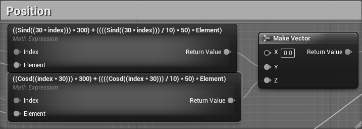
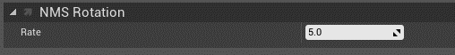
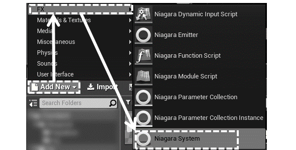

# UE4でアイマス楽曲をさらに盛り上げてけ☆
<p class="right">著:croMisa</p>

## はじめに
Unreal Engine 4(以下UE4)は、Epic Gameが開発する商用ゲームエンジンです。モバイル向けのゲームのほとんどはUnity製ですが、大規模タイトルでは国内でも採用されています。アイマスと関わりの深い(\*1)エースコンバットシリーズの最新作でも採用されています。最近はゲームエンジンを、3DCG表示ソフトウェアの統合開発環境として使用することが増えています。UE4ではそのような非ゲーム向け用途を「エンタープライズ用途」と名付け、様々な機能を盛り込んでいます。

今回は、UE4を使ってゲームではなく、アイマス楽曲を盛り上げるためのソフトウェアの簡単な例を作成します。この例を発展させることで将来的には、VJ(Visual Jocker)で使用できるような映像表現を獲得できるでしょう。

<footer>\*1：https://idolmaster.jp/blog/?p=10945 など</footer>

## ゴール
完成イメージはこちら。グレースケール画像のため、色感は調整されています。
<center><br/>
図1 完成イメージ</center>

BGMをスペクトル解析しそれを円形に配置されたBoxを伸ばすことで、オーディオスペクトラムを表現しています。流れている音声を周波数領域ごとに大きさを取り出して表示するものです。カーステレオによく表示されているようなアレです。それとは別にBPMに合わせて、中央から△を外側へ放出しています。キャプチャした映像は@croMisaの固定ツイートになっています。(\*2)

完成品はGitHubにあります(\*3)。  

<footer>\*2：https://twitter.com/croMisa/status/1188376656718651392</footer>
<footer>\*3：https://github.com/crssnky/UE4_SoundEffect</footer>

## 開発環境
必要なもの
- Unreal Engine 4  
今回は、バージョン4.23.1で説明します。  
自分でビルド、バイナリの入手、どちらでも構いません。
- Visual Studio 2017/2019 or Xcode  
ビルドしなければ、たぶん無くても良い。たぶん。  
- ローリング△さんかく(WAV形式)  
△・□・○と、プリミティブな形がいっぱい出てくるので。  
その他の楽曲でも構いません。

## 作成
### 下準備
初めに、UE4のプロジェクトを作成します。UE4を起動すると、既存のプロジェクトを選んだり、新規プロジェクトを作成するウィンドウが表示されます。また、初回起動はShaderCompileが走ります(\*4)。ShaderCompileは、可能な限りCPUを使ってコンパイルし、そこそこの時間がかかります。PCは一旦放置し、スマフォでプロデュース業をして待ちましょう。

<footer>\*4：プロジェクト作成後だったかも...</footer>

<center><br/>
図2 Project Window(一部ぼかし有り)</center>

"New Project"タブを選択し、BlueprintのBlankテンプレートを選択します。下の3つのオプションについては、デフォのままで大丈夫です。

<center><br/>
図3 プロジェクト作成</center>

プロジェクトを作成したら一旦UE4を終了し、Configファイルを開きます。
- Windowsユーザ
  - (プロジェクトディレクトリ)/Config/Windows/WindowsEngine.ini
- Macユーザ
  - (プロジェクトディレクトリ)/Config/Mac/MacEngine.ini
  
次の設定を追記します。
```INI
[Audio]
AudioDeviceModuleName=AudioMixerXAudio2
```
最後に、UE4でプロジェクトを開いてプラグインを有効にします。メニューバーから"Edit"->"Plugins"でプラグインウィンドウを開きます。

<center><br/>
図4 プラグインウィンドウを開く</center>

"Audio"カテゴリにある、"Sound Utilities"・"Time Synth"を有効化します。UE4の再起動を求められたら再起動します。

<center><br/>
図5 プラグインを有効化</center>

以上で下準備は終わりです。次から作成に入ります。

### Spectre Visualizer① ～BGMを反映～
SpectreVisualizerをBlueprint(以下BP)で作成します。コンテンツブラウザからBPをActorで作成し、適当な名前を付けてください。  
<center><br/>
図6 BPの作成</center>

作成したBPを開くと"Blueprint Editor"(\*5)が開きます。"Blueprint Editor"は主に、BPの見た目の確認や変更ができる"Viewport"とBPグラフを記述する"Construction Script"・"Event Graph"等があります。
<footer>\*5：https://docs.unrealengine.com/ja/Engine/Blueprints/Editor/index.html</footer>

最初に、このBPに"InstancedStaticMesh"コンポーネントを追加します。"Component"タブから"Add Component"で追加です。名前検索も可能です。  
<center><br/>
図7 InstancedStaticMeshの追加</center>

追加しても"Viewport"には変化はありません。この"InstancedStaticMesh"は、指定したStaticMeshを連続で軽量に表示するコンポーネントです。ですので、StaticMeshを指定します。  
"Detail"タブにある"StaticMesh"グループの中に"StaticMesh"を指定できる箇所があります。そこで"Cube"を指定します。いくつか同じものがありますが、`/Engine/BasicShapes/`のPathを持つものを指定します。マウスオーバーで確認できます。  
<center><br/>
図8 StaticMeshの指定</center>

指定しても"Viewport"には変化はありません。何も起こらなくても操作に間違いはありません。次の操作では、実際に指定されたStaticMeshをどのようにどれくらい配置するかを設定します。  
"Construction Script"タブを開いてください。名前の通り、これはコンストラクタを記述する部分です。とはいえBPグラフなので、ノードを接続するビジュアルプログラミングをしていきます。フローチャートのようなものですので安心してください。

グラフを記述する前に、メンバ変数を1つ宣言します。"My Blueprint"タブから"Variables"グループの＋ボタンを押してメンバ変数を追加します。また、"Details"タブでそのメンバ変数を整えます。変数名は"FrequencyValues"(じゃなくても良い)、変数の型はFloatのArray型です。BPにはdouble型は無いので諦めましょう。単一の変数からArray型などに変更する方法は、型の一覧が出るドロップダウンメニューの外の右側のアイコンをクリックします。  
<center><br/>
図9 メンバ変数の宣言</center>

ようやくBPグラフを記述していきます。最終的に図10になれば良いですが、見辛いと思うので小分けにして説明します。
<center><br/>
図10 Construction Script全体</center>

開始ノードに繋ぐのは`For Loop`ノードです。N個の箱を生成するので、その数だけ回しましょう。例でお見せしたものは12個なので、1～12とします。

<center><br/>
図11 Construction Script①</center>

続いては中央部です。まず、"FrequecyValues"に値を追加する`ADD`ノードです。BlueprintでのArray型はstd::vector型と似た可変配列となっています(\*6)。値を入れる場所を確保するだけですが、なんとなくバラバラにしたいのでLoopIndexを100倍したものを入れておきましょう。
<footer>\*6：https://docs.unrealengine.com/ja/Programming/UnrealArchitecture/TArrays/index.html</footer>

`Add`ノードとは別に下で行っていることは、Boxの位置と向きをセットするための計算です。今回は12個なので、`360 / 12`した30を掛けた値を`SINd`・`COSd`ノードに入れます。これらの`d`という文字列は"Degree"を指します。もちろん`SIN`・`COS`ノードがあり、"Radian"に対応しています。出てきた値は200倍して重ならないようにしましょう。  
向きは30度ずつロールして外側へ伸びるように、同じようにLoopIndexに30を掛けた値を作ります。

<center><br/>
図12 Construction Script②</center>

最後に`Add Instance`ノードです。"InstancedStaticMesh"にインスタンスを追加していきます。"Location"(位置)は、先ほど`SINd`・`COSd`ノードで作成した値を`Make Vector`ノードでVector型に合成して接続します。UE4では、X軸が奥行方向のため、上下左右はY・Z軸です。"Rotation"(向き)は、LoopIndexに30を掛けた値を`Make Rotation`ノードでRotation型のRoll軸に接続して合成し設定します。"Scale"(大きさ)は、Z軸を0にしましょう。

<center><br/>
図13 Construction Script③</center>

以上でConstructionScriptの作成が完了しました。Compileボタンを押して、Blueprintをコンパイルしましょう。コンパイルが成功したら"Viewport"タブで結果を確認してください。接続した内容通り、Z軸の大きさが0の薄いBOXが円を描いていると思います。ちなみに、真ん中の白い球はActorクラスの原点を表しています。

<center><br/>
図14 ConstructionScriptの完成後</center>

ここまではただの初期化。ここからBGMの再生機能と、それに合わせたBOXの伸縮の処理を描いていきます。  
まずはBGMです。"Component"タブから"Add Component"で、"Audio"を追加します。

<center><br/>
図14 "Audio"コンポーネントの追加</center>

そしてその"Audio"コンポーネントの、SoundグループのSoundにUE4にWAV形式で読み込ませた`ローリング△さんかく`を適用します。また、"Activation"グループの"Auto Activate"を`False`にします。これで、任意のタイミングでBGMとして流すことができます。

<center><br/>
図14 Soundファイルの適用</center>

任意のタイミングでBGMを再生する処理をBPグラフで記述します。"Event Graph"タブを開いてください。再生イベントは何でも良いですが、今回の例では`Right Mouse Button`ノードを使用します。`Pressed`ピンから`Flip Flop`ノードに接続します。このノードは、処理が通るたびに`A`ピン・`B`ピンに交互に進むものです。今回の例で言えば、右クリックするたびに通る処理が交互になるといったものです。

Aルートでは、再生に関する処理を描いていきます。まず、`Start Analyzing Output`ノードを呼びます。これはスペクトル解析を開始するノードです。スペクトル解析は決して軽い処理ではないため、必要なときだけ解析ができるようになっています。そして、"Audio"コンポーネントをグラフ内に持っていき、`Play`ノードを接続します。これで再生時に必要な処理は終わりです。

Bルートでは、停止に関する処理を描いていきます。停止中はスペクトル解析する必要はないため、`Stop Analyzing Output`ノードを呼びます。そして"Audio"コンポーネントから`Stop`ノードを接続し、BGMを停止させます。

<center><br/>
図14 Event Graph①</center>

入力に関する処理を描いたら、このBPに入力できるよう設定を変更しましょう。"Class Defaults"からBP自体の設定を変えられます。"Class Defaults"を押し、"Details"タブから"Input"グループの"Auto Receive"を`Player 0`に変更します。

<center><br/>
図14 入力を許可</center>

ここで一旦、ゲームに配置して動作を確かめてみましょう。"Content Browser"タブからBPを"Viewport"タブへドラッグ&ドロップして配置してください。そして、上のツールバーにある"Play"で試してみてください。右クリックでBGMの再生と停止ができるようになっていると思います。

<center><br/>
図14 BPを配置し、Play</center>

"Blueprint Editor"に戻り、続いてスペクトル解析の結果を周期的に取得し、表現する処理です。この「周期的」の部分は、`Set Timer by Event`ノードを使用します。これは`Event`ピンに接続された`Event`ノードを指定時間後に呼び出すノードです。ループすることで一定周期で処理を呼び出すことができます。出力側にある`Return Value`ピンはイベントに対するハンドルです。これを図xxのように変数に保存しておくことで、後々そのイベントを停止するときなどに使用できます。今回はBGMを停止したら周期処理も止まるように、`Clear and Invalidate Timer by Handle`ノードを接続しています。

<center><br/>
図14 出力の変数化(Promote to variable)</center>

<center><br/>
図14 Event Graph②</center>

最後に周期処理の中身を記述します。カスタムノード`UpdateSprctre`の右上の□は、`Set Timer by Event`ノードの`Event`ピンと繋がっています。こうして周期処理で行うイベントを紐付けています。  
`Get Magnitude for Frequencies`ノードでスペクトル解析の結果を取得します。入力した配列サイズと同じサイズの配列で出力されます。このサイズはBOXの数と同じはずなので、この結果の配列を用いて`For Each Loop`して各BOXに適用していきます。

<center><br/>
図14 Event Graph③</center>

まず位置に関する部分です。位置は配列のIndexと要素から算出するため、`MathExpression`ノードを使っています。算出された値は`Make Vector`ノードで`Y`・`Z`ピンにそれぞれ入力されて座標を作ります。`MathExpression`ノードは

```
Y軸：Sind(index*30)*200 + Sind(index*30)/10*50*Element
Z軸：上記の式でSind -> Cosdにしたもの
```

を`Expression`として入力しています。`index`や`Element`といった変数名は`Expression`に入力されると、自動的にノードの入力ピンにも追加されます。`For Each Loop`ノードからそれぞれ繋ぎます。

<center><br/>
図14 Event Graph④</center>

続いて向きです。Construction Scriptと同様に、`For Each Loop`ノードの`Array Index`ピンに`30`を掛けた値を`Make Rotator`の`Roll`ピンに接続しています。

<center><br/>
図14 Event Graph⑤</center>

次は大きさです。一般的なスペクトルビジュアライザのように、値が大きいほど箱を大きくします。でも解析結果の値が大きすぎるため、`For Each Loop`ノードの`Array Element`ピンに`0.1`を掛けた値を`Make Vector`の`Z`ピンに接続しています。

<center><br/>
図14 Event Graph⑥</center>

最後に、"Instanced Static Mesh"を"Components"から持ってきて、`Update Instance Transform`ノードに接続します。`Instance Index`ピンには`For Each Loop`ノードの`Array Index`ピンを接続します。`Transform`ピンは右クリックで`Split Struct Pin`をして、`Location`・`Rotation`・`Scale`ピンに分割しましょう。それぞれに先程求めた位置・向き・大きさを繋げば完成です。

<center><br/>
図14 Event Graph⑦</center>

これで、BGMをスペクトル解析するビジュアライザが完成しました。"Play"して、実際にできているか確認してみましょう。

### Position based colors ～位置と色相で良い感じの色～
作った方はお気付きですね。そうです。**色が無ーーーい！！**というわけで、このMeshに対して色を設定していきましょう。色は、Boxの位置によって色相(Hue)が移り変わる綺麗そうなものにします。

UE4では色や質感をMaterialで記述していきます。Blueprintと同様のノードとブランチのビジュアルプログラミングで記述できます。最終的にはターゲット機器に合わせたShaderCodeに変換されます。  
まず、コンテンツブラウザからMaterialを作成し、適当な名前を付けてください。

<center><br/>
図15 Materialの作成</center>

作成したMaterialを開くと"Material Editor"(\*7)が開きます。結果を確認しながらシェーダーを記述できます。
<footer>\*7：https://docs.unrealengine.com/ja/Engine/Rendering/Materials/Editor/index.html</footer>

最初に、このマテリアルの"Shading Model"を変更します。今回は、光の影響を受けさせる気は無いので`Unlit`にします。  
<center><br/>
図16 Materialの全体</center>

今回作成するグラフは図17です。こちらも小分けにして説明します。

<center><br/>
図17 Materialの全体</center>

まず初めに位置を取得します。`Absolute World Position`ノードは、各ピクセルが画面のどの位置を表示しているかを取得できます。つまりMeshの表面の1点1点がワールド座標のどの位置かがわかります。位置はXYZで返ってくるため、`BreakOutFloat3Components`でそれぞれを一つに分割します。出力ピンがR・G・Bとなっていますが、1個目2個目3個目のことを指していると思われます。

先程作成したBPはY・Z軸に広がるものでしたので、G・Bピンを使って色相の角度を求めます。今回は簡単に、`Arctangent2`ノードで求めます(Y軸が横、Z軸が高さなので本来ならばGピンとXピンが繋がれるはずですが、逆になっても対して変わらないので、見やすさ重視で平行に繋いでいます)。ちなみに`Arctangent2`は負荷が高いため、`Arctangent2Fast`で代用しても構いません。

また、次の計算のために"2π"を`Constant`・`Pi`ノードで作成します。

<center><br/>
図18 Material①</center>

後半です。まず、`Arctangent2`ノードで求めた角度を正規化します。`Divede`ノードを使って"2π"で割ります。そしてその値を`HueShift`ノードで色相として求め、それを`EmissiveColor`ピンに接続します。  
これで完成です！色相がぐるっと変化しているのがプレビューで確認できると思います。

<center><br/>
図19 Material②</center>

最後にこれを、先程作成したBPの適用します。BlueprintEditorを開き、"Components"タブで"InstancedStaticMesh"を選択します。そして"Details"タブの"Materials"グループの"Element 0"を作成したMaterialに変更します。"Viewport"タブのStaticMeshにも色がついたことでしょう。

<center><br/>
図20 Materialの適用</center>

### Niagara① ～ローリング△さんかく～
続いては、BPMに合わせて△を放出する部分です。こちらはエフェクトで実装しますが、UE4のメインのエフェクトツール"Cascade"ではなく、新しいエフェクトツール"Niagara"(\*8)を使用します。
<footer>\*8：まだベータ機能であることに注意してください</footer>

まず初めに放出する△自体をMaterialで作ります。BPのMaterialと同様に"Shading Model"は`Unlit`です。また、徐々に透明になって消えてほしいため、"Blend Mode"は`Translucent`を選択しましょう。

<center><br/>
図21 エフェクトに使うMaterialの設定</center>

Materialのグラフは図22のような感じです。`Particle Color`ノードと`TextureSampleParameter2D`ノードの1・4番目のピンをそれぞれ`Multiply`ノードで乗算し、`Emissive Color`・`Opacity`ピンに接続します。  
`Particle Color`ノードとは、Material内で色を決めず、エフェクトツールで色を指定した時に入力されるノードです。`TextureSampleParameter2D`ノードは、テクスチャを入力可能なパラメータにできるノードです。後述するMaterial Instanceなどで活きるノードです。とりあえず今は、背景が透明で白い線の△の画像を適用しておいてください。画像の作り方は何でも良いです。僕はPowerPointで作りました。縦横比は**正方形**でお願いします。

<center><br/>
図22 使用するテクスチャ例と作成するMaterial</center>

続いて、"Niagara"を用いてエフェクトを作成していきます。"Niagara"はベータ機能であるため、デフォルトではOffになっています。メニューバーから"Edit"-> "Plugins"でプラグインウィンドウを開き、"Niagara"を有効化しましょう。

<center><br/>
図23 "Niagara"を有効化</center>

有効化したら、"Add New"の中に"FX"グループが増えているはずなので、そこから"Niagara Emitter"を作成し、適当な名前をつけて開きます。

<center><br/>
図24 "Niagara Emitter"を作成</center>

するとEmitterの作成ダイアログが現れます。"Create a new emitter from an emitter template"を選択し、`Omnidirectional Burst`テンプレートを選択してOKして作成しましょう。

<center><br/>
図25 "Niagara Emitter"のテンプレートを設定</center>

作成したNiagara Emitterファイルを開くと、"Niagara Editor"(\*9)が立ち上がります。こちらもMaterialと同様に、結果を確認しながらエフェクトを調整することができます。
<footer>\*9：https://docs.unrealengine.com/ja/Engine/Niagara/NiagaraKeyConcepts/index.html</footer>

それでは設定していきましょう。主に設定は、"Selected Emitters"タブにある各種パラメータを編集することでできます。

"Emitter Spawn"はそのままにします。"Emitter Update"では、"Spawn Burst Instantaneous"モジュールを編集します。"Spawn Count"を`25`にします。そうすることで、一度に放出されるパーティクルが25個に減少します。

<center><br/>
図26 "Spawn Burst Instantaneous"モジュール</center>

続いて"Particle Spawn"です。ここではパーティクルの生成に関するモジュールが入っています。今回は必要ない、"Initialize Particle"モジュール以外をゴミ箱マークで削除し、右上の"+"マークで`Torus Location`・`Point Force`・`Apply Initial Forces`モジュールを追加します。

<center><br/>
図27 "Particle Spawn"のモジュール変更後</center>

モジュール内のパラメータを見ていきましょう。"Initialize Particle"モジュールでは、LifeTime`1.65～2.0`・Mass`6～1.2`・Color`R:10, G:5, B:0, A:1`・Sprite Size`X:50, Y:50`・Sprite Rotation`0.0～1.0`とします(変更点のみ記載)。

<center><br/>
図28 "Initialize Particle"モジュール</center>

"Torus Location"モジュールでは、Torus Mode`Ring`・Large Radius`10.0`・Torus Axis`X:1, Y:0, Z:0`とします(変更点のみ記載)。

<center><br/>
図29 "Torus Location"モジュール</center>

"Point Forces"モジュールでは、Force Strength`1000.0`とします(変更点のみ記載)。また、"Apply Initial Forces"モジュールにはパラメータが無いため変更点は無いです。

<center><br/>
図30 "Point Forces"モジュール</center>

続いて"Particle Update"です。ここでは生成されたパーティクルに対するモジュールが入っています。"Update Age"・"Drag"・"Scale Color"・"Solve Forces and Velocity"モジュールを残して他を消し、`NMS Rotation`モジュールを追加します。

<center><br/>
図31 "Particle Update"のモジュール変更後</center>

<big>**待った！！**</big>

実は`NMS Rotation`モジュールはありません。これは**自作**のモジュールだからです。ですので、みなさんにも作成していただきます。まず、図32のように"Niagara Module Script"を作成し`NMS Rotation`と名付けましょう(名前は合わせなくても良いですが、変える場合は`NMS Rotation`をその名前に読み替えてください)。

<center><br/>
図32 "Niagara Module Script"の作成</center>

作成したNiagara Module Scriptファイルを開くと、"NiagaraModuleEditor"が立ち上がります。ここで言う"Map"とは"std::map"のようなKey・Valueのコンテナを指します。`Map Get`ノードからパラメータの値を取得し、処理して、`Map Set`でパラメータを更新することができます。

作成する`NMS Rotation`では、パーティクルをローリング(回転)させる処理を書いていきます。まず回転量を指定できるパラメータを作成します。"Parameters"タブから"Module"グループの"+"ボタンを押して、`float`型で作ります。名前は何でも良いですが、`Module.`を頭に付ける必要があります。

<center><br/>
図32 モジュールパラメータの作成</center>

パラメータを作成したら、それを使ってグラフを記述していきます。`InputMap`ノードに繋がっている`Map Get`ノードにある"+"ボタンを押し、`Particles.SpriteRotation`・`Module.rate`ピンを作成します。この2つのピンの値を`Add`ノードで加算します。`Output Module`ノードに繋がっている`Map Set`ノードの"+"ボタンを押し、`Particles.SpriteRotation`ピンを作成します。このピンに加算結果をつなげることで、ローリング(回転)させる処理が完成しました。

<center><br/>
図33 NMS Rotationのグラフ</center>

ウィンドウを再び"Niagara Editor"に戻し、"Particle Update"に作成した"Niagara Module Script"を追加して図31と同じモジュール構成にしましょう。  
構成し終えたら中のパラメータを編集していきます。"Update Age"・"Solve Forces and Velocity"は編集するパラメータが無いため、デフォルトのままにします。

"Drag"モジュールでは、Drag`2.0`とします(変更点のみ記載)。

<center><br/>
図34 "Drag"モジュール</center>

"Scale Color"モジュールでは、"Scale Alpha"を"Curve Editor"で編集します。デフォルトでは正規化されたパーティクルの寿命に対してリニアに減っていくので、グラフを右クリックしてKeyを追加したり、Keyを右クリックして補間方法を変えてお好みのAlpha値の減少カーブを作成してください。

<center><br/>
図35 "Scale Color"モジュール</center>

作成した"NMS Rotation"モジュールでは、Rate`5.0`としますが、お好みで構いません。

<center><br/>
図36 "NMS Rotation"モジュール</center>

最後に"Render"です。ここではパーティクル1つ1つがどういうものかを設定します。今回は先ほど作成したパーティクル用マテリアルを適用するだけで大丈夫です。

<center><br/>
図37 パーティクルにMaterialを設定</center>

以上でエフェクト作成は終わりです。中央からローリング△さんかくを放出するものがプレビューに表示されているのではないでしょうか。

作成した"Niagara Emitter"は、"Niagara System"に組み込む必要があります。"Niagara System"とは、エフェクトをゲーム空間に配置できるクラスで、複数のEmitterを内包できます。  
"Niagara Emitter"と同様に、"FX"グループから"Niagara System"を作成します。

<center><br/>
図37 "Niagara System"の作成</center>

"Niagara Emitter"と同様に、作成ダイアログが立ち上がります。今回は"Create a new system from a set of selected emitters"を選択し、作成した"Niagara Emitter"ファイルを選択、"+"ボタンで追加してOKします。

<center><br/>
図37 "Niagara System"の設定</center>

以上でエフェクトをゲーム空間に配置できるようになりました。次の章でエフェクトを出現させます。

### Spectre Visualizer② ～BPMを反映～
エフェクトを作成しましたが、どれにも紐付けていないため"Play"してもエフェクトが現れることはありません。

### Niagara② ～もうちょっとカドを少なく～

### Spectre Visualizer③ ～歌詞を反映～

## おわりに

## 参考
