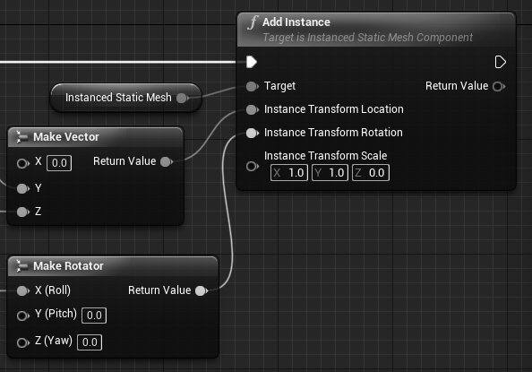

# UE4でアイマス楽曲をさらに盛り上げてけ☆
<p class="right">著:croMisa</p>

## はじめに
Unreal Engine 4(以下UE4)は、Epic Gameが開発する商用ゲームエンジンです。モバイル向けのゲームのほとんどはUnity製ですが、大規模タイトルでは国内でも採用されています。アイマスと関わりの深い(\*1)エースコンバットシリーズの最新作でも採用されています。最近はゲームエンジンを、3DCG表示ソフトウェアの統合開発環境として使用することが増えています。UE4ではそのような非ゲーム向け用途を「エンタープライズ用途」と名付け、様々な機能を盛り込んでいます。

今回は、UE4を使ってゲームではなく、アイマス楽曲を盛り上げるためのソフトウェアの簡単な例を作成します。この例を発展させることで将来的には、VJ(Visual Jocker)で使用できるような映像表現を獲得できるでしょう。

<footer>\*1：https://idolmaster.jp/blog/?p=10945 など</footer>

## ゴール
完成イメージはこちら。グレースケール画像のため、色感は調整されています。
<center><br/>
図1 完成イメージ</center>

BGMをスペクトル解析しそれを円形に配置されたBoxを伸ばすことで、オーディオスペクトラムを表現しています。流れている音声を周波数領域ごとに大きさを取り出して表示するものです。カーステレオによく表示されているようなアレです。それとは別にBPMに合わせて、中央から△を外側へ放出しています。キャプチャした映像は@croMisaの固定ツイートになっています。(\*2)

完成品はGitHubにあります(\*3)。  

<footer>\*2：https://twitter.com/croMisa/status/1188376656718651392</footer>
<footer>\*3：https://github.com/crssnky/UE4_SoundEffect</footer>

## 開発環境
必要なもの
- Unreal Engine 4  
今回は、バージョン4.23.1で説明します。  
自分でビルド、バイナリの入手、どちらでも構いません。
- Visual Studio 2017/2019 or Xcode  
ビルドしなければ、たぶん無くても良い。たぶん。  
- ローリング△さんかく(WAV形式)  
△・□・○と、プリミティブな形がいっぱい出てくるので。  
その他の楽曲でも構いません。

## 作成
### 下準備
初めに、UE4のプロジェクトを作成します。UE4を起動すると、既存のプロジェクトを選んだり、新規プロジェクトを作成するウィンドウが表示されます。また、初回起動はShaderCompileが走ります(\*4)。ShaderCompileは、可能な限りCPUを使ってコンパイルし、そこそこの時間がかかります。PCは一旦放置し、スマフォでプロデュース業をして待ちましょう。

<footer>\*4：プロジェクト作成後だったかも...</footer>

<center><br/>
図2 Project Window(一部ぼかし有り)</center>

"New Project"タブを選択し、BlueprintのBlankテンプレートを選択します。下の3つのオプションについては、デフォのままで大丈夫です。

<center><br/>
図3 プロジェクト作成</center>

プロジェクトを作成したら一旦UE4を終了し、Configファイルを開きます。
- Windowsユーザ
  - (プロジェクトディレクトリ)/Config/Windows/WindowsEngine.ini
- Macユーザ
  - (プロジェクトディレクトリ)/Config/Mac/MacEngine.ini
  
次の設定を追記します。
```INI
[Audio]
AudioDeviceModuleName=AudioMixerXAudio2
```
最後に、UE4でプロジェクトを開いてプラグインを有効にします。メニューバーから"Edit"->"Plugins"でプラグインウィンドウを開きます。

<center><br/>
図4 プラグインウィンドウを開く</center>

"Audio"カテゴリにある、"Sound Utilities"・"Time Synth"を有効化します。UE4の再起動を求められたら再起動します。

<center><br/>
図5 プラグインを有効化</center>

以上で下準備は終わりです。次から作成に入ります。

### Spectre Visualizer① ～BGMを反映～
SpectreVisualizerをBlueprint(以下BP)で作成します。コンテンツブラウザからBPをActorで作成し、適当な名前を付けてください。  
<center><br/>
図6 BPの作成</center>

作成したBPを開くと"Blueprint Editor"(\*5)が開きます。"Blueprint Editor"は主に、BPの見た目の確認や変更ができる"Viewport"とBPグラフを記述する"Construction Script"・"Event Graph"等があります。
<footer>\*5：https://docs.unrealengine.com/ja/Engine/Blueprints/Editor/index.html</footer>

最初に、このBPに"InstancedStaticMesh"コンポーネントを追加します。"Component"タブから"Add Component"で追加できます。名前検索も可能です。  
<center><br/>
図7 InstancedStaticMeshの追加</center>

追加しても"Viewport"には変化はありません。この"InstancedStaticMesh"は、指定したStaticMeshを連続で軽量に表示するコンポーネントです。ですので、StaticMeshを指定します。  
"Detail"タブにある"StaticMesh"グループの中に"StaticMesh"を指定できる箇所があります。そこで"Cube"を指定します。いくつか同じものがありますが、`/Engine/BasicShapes/`のPathを持つものを指定します。マウスオーバーで確認できます。  
<center><br/>
図8 StaticMeshの指定</center>

指定しても"Viewport"には変化はありません。何も起こらなくても操作に間違いはありません。次の操作では、実際に指定されたStaticMeshをどのようにどれくらい配置するかを設定します。  
"Construction Script"タブを開いてください。名前の通り、これはコンストラクタを記述する部分です。とはいえBPグラフなので、ノードを接続するビジュアルプログラミングをしていきます。フローチャートのようなものですので安心してください。

グラフを記述する前に、メンバ変数を1つ宣言します。"My Blueprint"タブから"Variables"グループの＋ボタンを押してメンバ変数を追加します。また、"Details"タブでそのメンバ変数を整えます。変数名は"FrequencyValues"(じゃなくても良い)、変数の型はFloatのArray型です。BPにはdouble型は無いので諦めましょう。単一の変数からArray型などに変更する方法は、型の一覧が出るドロップダウンメニューの外の右側のアイコンをクリックします。  
<center><br/>
図9 メンバ変数の宣言</center>

ようやくBPグラフを記述していきます。最終的に図10になれば良いですが、見辛いと思うので小分けにして説明します。
<center><br/>
図10 Construction Script全体</center>

開始ノードに繋ぐのは`For Loop`ノードです。N個の箱を生成するので、その数だけ回しましょう。例でお見せしたものは12個なので、1～12とします。

<center><br/>
図11 Construction Script①</center>

続いては中央部です。まず、"FrequecyValues"に値を追加する`ADD`ノードです。BlueprintでのArray型はstd::vector型と似た可変配列となっています(\*6)。値を入れる場所を確保するだけですが、なんとなくバラバラにしたいのでLoopIndexを100倍したものを入れておきましょう。
<footer>\*6：https://docs.unrealengine.com/ja/Programming/UnrealArchitecture/TArrays/index.html</footer>

`Add`ノードとは別に下で行っていることは、Boxの位置と向きをセットするための計算です。今回は12個なので、`360 / 12`した30を掛けた値を`SINd`・`COSd`ノードに入れます。これらの`d`という文字列は"Degree"を指します。もちろん`SIN`・`COS`ノードがあり、"Radian"に対応しています。出てきた値は200倍して重ならないようにしましょう。  
向きは30度ずつロールして外側へ伸びるように、同じようにLoopIndexに30を掛けた値を作ります。

<center><br/>
図12 Construction Script②</center>

最後に`Add Instance`ノードです。"InstancedStaticMesh"にインスタンスを追加していきます。"Location"(位置)は、先ほど`SINd`・`COSd`ノードで作成した値を`Make Vector`ノードでVector型に合成して接続します。UE4では、X軸が奥行方向のため、上下左右はY・Z軸です。"Rotation"(向き)は、LoopIndexに30を掛けた値を`Make Rotation`ノードでRotation型のRoll軸に接続して合成し設定します。"Scale"(大きさ)は、Z軸を0にしましょう。

<center><br/>
図13 Construction Script③</center>

以上でConstructionScriptの作成が完了しました。Compileボタンを押して、Blueprintをコンパイルしましょう。コンパイルが成功したら"Viewport"タブで結果を確認してください。接続した内容通り、Z軸の大きさが0の薄いBOXが円を描いていると思います。ちなみに、真ん中の白い球はActorクラスの原点を表しています。

<center><br/>
図14 ConstructionScriptの完成後</center>

### Position based colors ～位置と色相で良い感じの色～
作った方はお気付きですね。そうです。**色が無ーーーい！！**というわけで、このMeshに対して色を設定していきましょう。色は、Boxの位置によって色相(Hue)が移り変わる綺麗そうなものにします。

UE4では色や質感をMaterialで記述していきます。Blueprintと同様のノードとブランチのビジュアルプログラミングで記述できます。最終的にはターゲット機器に合わせたShaderCodeに変換されます。  
まず、コンテンツブラウザからMaterialを作成し、適当な名前を付けてください。

<center><br/>
図15 Materialの作成</center>

作成したMaterialを開くと"Material Editor"(\*7)が開きます。結果を確認しながらシェーダーを記述できます。
<footer>\*7：https://docs.unrealengine.com/ja/Engine/Rendering/Materials/Editor/index.html</footer>

最初に、このマテリアルの"Shading Model"を変更します。今回は、光の影響を受けさせる気は無いので`Unlit`にします。  
<center><br/>
図16 Materialの全体</center>

今回作成するグラフは図17です。こちらも小分けにして説明します。

<center><br/>
図17 Materialの全体</center>

まず初めに位置を取得します。`Absolute World Position`ノードは、各ピクセルが画面のどの位置を表示しているかを取得できます。つまりMeshの表面の1点1点がワールド座標のどの位置かがわかります。位置はXYZで返ってくるため、`BreakOutFloat3Components`でそれぞれを一つに分割します。出力ピンがR・G・Bとなっていますが、1個目2個目3個目のことを指していると思われます。

先程作成したBPはY・Z軸に広がるものでしたので、G・Bピンを使って色相の角度を求めます。今回は簡単に、`Arctangent2`ノードで求めます(Y軸が横、Z軸が高さなので本来ならばGピンとXピンが繋がれるはずですが、逆になっても対して変わらないので、見やすさ重視で平行に繋いでいます)。ちなみに`Arctangent2`は負荷が高いため、`Arctangent2Fast`で代用しても構いません。

また、次の計算のために"2π"を`Constant`・`Pi`ノードで作成します。

<center><br/>
図18 Material①</center>

後半です。まず、`Arctangent2`ノードで求めた角度を正規化します。`Divede`ノードを使って"2π"で割ります。そしてその値を`HueShift`ノードで色相として求め、それを`EmissiveColor`ピンに接続します。  
これで完成です！色相がぐるっと変化しているのがプレビューで確認できると思います。

<center><br/>
図19 Material②</center>

最後にこれを、先程作成したBPの適用します。BlueprintEditorを開き、"Components"タブで"InstancedStaticMesh"を選択します。そして"Details"タブの"Materials"グループの"Element 0"を作成したMaterialに変更します。"Viewport"タブのStaticMeshにも色がついたことでしょう。

<center><br/>
図20 Materialの適用</center>

### Niagara① ～ローリング△さんかく～

### Spectre Visualizer② ～BPMを反映～

### Niagara② ～もうちょっとカドを少なく～

### Spectre Visualizer③ ～歌詞を反映～

## おわりに

## 参考
