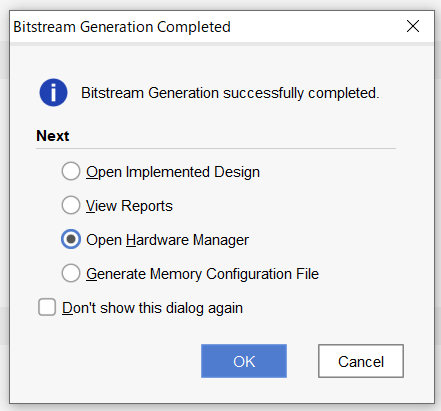

# FPGAでモテモテなハッピーライフをエンジョイしようよ！　by へヴろく


## ねぇねぇ！プロデューサーさん、今日は一日中おしゃべりしたいな～、ダメ？


## もくじ

・FPGAのすすめ

・コーディングのお作法だよ

・765カウンタをつくってみよう

※若葉マークのみんな（自分）向けの記事です。


## FPGAのすすめ
 みなさん！FPGA使ってますか？？最近話題の例のアレです。  FPGA:言語ベースで回路を構成し所望の動作をさせることができるデバイス。  最近はARMのコアとHBMメモリーを搭載したりしていろいろ良くわかりません。

#### 「FPGAは難しいよー。ラズパイじゃだめなの？」

 最初は自分もそう思っていました。FPGAはフルに使いこなそうとすると難しいですしお金もかかります。でもちょっとしたものなら簡単に無料で作ることができますので、用途に合わせて選択して欲しいと思います。この後つくる765カウンタならラズパイのほうがお手軽かもです。

#### 「なんでFPGAなの？」

 　リアルタイムに処理ができる事につきます。ここのリアルタイムというのがミソで、ピコ秒オーダーでのタイミング調整ができますので、めちゃ速く動かすことができます。

 
## コーディングのお作法だよ
コーディングの言語としてはVerilog HDL（以下Verilog）で回路を記述すれば間違いないので、これから覚えるよって人はVerilogの文法を覚えましょう。この記事では回路ベースの書き方を説明します。

#### コメントは「//」か「/* */」で囲う<br>
とにかくコメントは書きましょう、可読性が下がるとか見ればわかるとかはスルーしましょう。

#### １ソース１モジュールを守ろう<br>
１つのソースにだらだらと全機能を書くのはやめたほうがいいです。さもなくばシミュレーションまではうまくいってもいざ回路に落とし込む場合に謎のエラーに悩まされるでしょう。

#### 割り算はしない<br>
気軽に記述出来るHDLですが演算子に「/」を使うのはやめた方がいいです。シフト演算のテクニックを使いましょう。

## 765カウンタをつくってみよう
腕試しにカウンタを765仕様でつくってみよう！

```
【部品】
Zynq-7000評価ボード
7セグメントLED　3個
電流制限抵抗
デジタルトランジスタ
```

```
【仕様】
右：0→5
中：0→6
左：0→7
```
右が5までカウントアップしたら桁上げして、中を6までカウントアップしたら、左を7までカウントアップして「765」を表示してストップ。
リセットとしてSW0を割り当てます。OFFでリセットし0点灯、ONで上記「765」をカウントします。

```
7セグメントLED仕様

  DP,A,B,C,D,E,F,G

DOT = DP            : 8'b1000_0000  
0   = A,B,C,D,E,F   : 8'b0111_1110
1   = B,C           : 8'b0011_0000
2   = A,B,D,E,G     : 8'b0110_1101
3   = A,B,C,D,G     : 8'b0111_1001
4   = B,C,F,G       : 8'b0011_0011
5   = A,C,D,F,G     : 8'b0101_1011
6   = A,C,D,E,F,G   : 8'b0101_1111
7   = A,B,C     　  : 8'b0111_0000
8   = A,B,C,D,E,F,G : 8'b0111_1111
9   = A,B,C,D,F,G   : 8'b0100_1011
E   = A,D,E,F,G     : 8'b0100_1111
```
ブロック図


## コーディングする
こんな感じで書いていきます。いずれもポイントになる部分を中心に記載しています。

#### CNT_765.v (カウンタモジュール)

MHz速度のクロックを目視で確認出来るレベル10Hzくらいに落とします。この信号を使ってカウント回路に入れ込みます。
```
//クロック分周回路
reg        [23:0]  cnt24;

always @( posedge CLK ) begin
    if ( !RST_N )
        cnt24 <= 24'h0;
    else
        cnt24 <= cnt24 + 1'h1;
end

wire ledcnt24 = ( cnt24 == 24'h8f_ffff );

//7セグメントLEDカウントアップ回路
reg        [3:0]   CNT_VAL_2;

always @( posedge CLK ) begin
    if ( !RST_N )
        CNT_VAL_2 <= 4'h0;
    else if ( ledcnt24 && ( CNT_VAL_1 == 4'd6 ) )
        if ( CNT_VAL_2 == 4'd7 )
            CNT_VAL_2 <= 4'd7;
        else
            CNT_VAL_2 <= CNT_VAL_2 + 1'h1;
end
```

#### CONT_7SEG.v (7セグメントLEDコントローラ)

7セグメントLEDの仕様に合わせてFPGAのポートを割り当てるテーブルになります。この回路にデシマルの値を入れるとその値が表示されます。デコーダ回路とも呼ばれます。
```
//7-SEG0
always @( SEG_VAL_0 ) begin
    case ( SEG_VAL_0 )
        4'd0    : SG0 = 8'b0111_1110; //A,B,C,D,E,F
        4'd1    : SG0 = 8'b0011_0000; //B,C
        4'd2    : SG0 = 8'b0110_1101; //A,B,D,E,G
        4'd3    : SG0 = 8'b0111_1001; //A,B,C,D,G
        4'd4    : SG0 = 8'b0011_0011; //B,C,F,G
        4'd5    : SG0 = 8'b0101_1011; //A,C,D,F,G
        4'd6    : SG0 = 8'b0101_1111; //A,C,D,E,F,G
        4'd7    : SG0 = 8'b0111_0000; //A,B,C
        4'd8    : SG0 = 8'b0111_1111; //A,B,C,D,E,F,G
        4'd9    : SG0 = 8'b0111_1011; //A,B,C,D,F,G
        default : SG0 = 8'b0100_1111; //A,D,E,F,G
    endcase
end
```

#### TOP_CNT_765.v（モジュール間接続）

全部一つのモジュールに入れることもできますが、とても見にくいのとシミュレーションがやりにくいので分けました。それをつなぐためのモジュールです。
```
CONT_7SEG CONT_7SEG(
    .SEG_VAL_3 ( CNT_OUT_3 ),
    .SEG_VAL_2 ( CNT_OUT_2 ),
    .SEG_VAL_1 ( CNT_OUT_1 ),
    .SEG_VAL_0 ( CNT_OUT_0 ),
    .SG3       ( { JE_2_DP, JE_3_A, JE_1_B, JE_4_C, 
    　　　　　　　　　JE_6_D, JE_8_E, JE_5_F, JE_7_G } ),

    .SG2       ( { JD_2_DP, JD_3_A, JD_1_B, JD_4_C, 
    　　　　　　　　　JD_6_D, JD_8_E, JD_5_F, JD_7_G } ),
    
    .SG1       ( { JC_2_DP, JC_3_A, JC_1_B, JC_4_C, 
    　　　　　　　　　JC_6_D, JC_8_E, JC_5_F, JC_7_G } ),
    
    .SG0       ( { JB_2_DP, JB_3_A, JB_1_B, JB_4_C, 
    　　　　　　　　　JB_6_D, JB_8_E, JB_5_F, JB_7_G } )
);
```

## シミュレーションしよう
回路のコーディングが終わったらつぎはシミュレーションプログラムをコーディングします。俗にいうテストベンチと呼ばれるものです。回路設計の大事なところです。コンパイルしてデバッグをするという手もありますが、回路規模が大きくなると非現実的になります。シミュレーションであらかじめモジュールごとの動きを検証します。自分も苦手なところですが頑張って書きましょう！


#### SIM_CNT_765.v
```
always begin
    clk = 0;  #(STEP/2);
    clk = 1;  #(STEP/2);
end

initial begin
    #STEP       rst_n = 0;
    #STEP       rst_n = 1;
end
```

### これだけです。。。簡単！


## 開発環境のインストール
Xilinxのハードウェア開発ツールとしてVivadoがありますので、これをPCにインストールします。使用できるデバイスは制限されますが、ほとんどの機能が利用できるWebPackのライセンスで使います。今回はこれで十分です。

ホストOS Windows10 64bit<br> 
開発ツール Vivado 2019.1<br>

オペレーションフロー
プロジェクトの新規作成→RTLデザイン→さっきのソースを指定。


## ハードウェアの準備

Xilinx Zynq-7000シリーズの開発ボードDigilent ZYBOで動かしてみましょう。

いずれの場合も使うピンは、制約ファイル(ZYBO_Master.xdc)でコメントアウトを解除してください。ネット名を合わせるのもお忘れなく！

### 7セグメントの点灯回路はこんな感じで作ります。


一つのLEDを直接駆動する方式でスタティック駆動と呼びます。トランジスタを使うのはFPGAのI/Oポートの駆動電流に制限があるためです。デジタルトランジスタを使うとベース抵抗を減らせるので楽ちんです。電源は+5Vを使います。

## 動かしてみる
いよいよ実機テストです。シミュレーションとピンの割り当てがうまくいっていれば動くはずです。

### この画面がでたらハッピー！！！


## おわりに
765カウンタをつくるプロジェクトはいかがでしたか？クロックだったり信号の向きを考えたり大変ですが少しでもFPGAをやるきっかけになればと思い執筆しました。

## プロデューサーさんって、FPGAだーいすきですよね。私も気に入っちゃったかも！